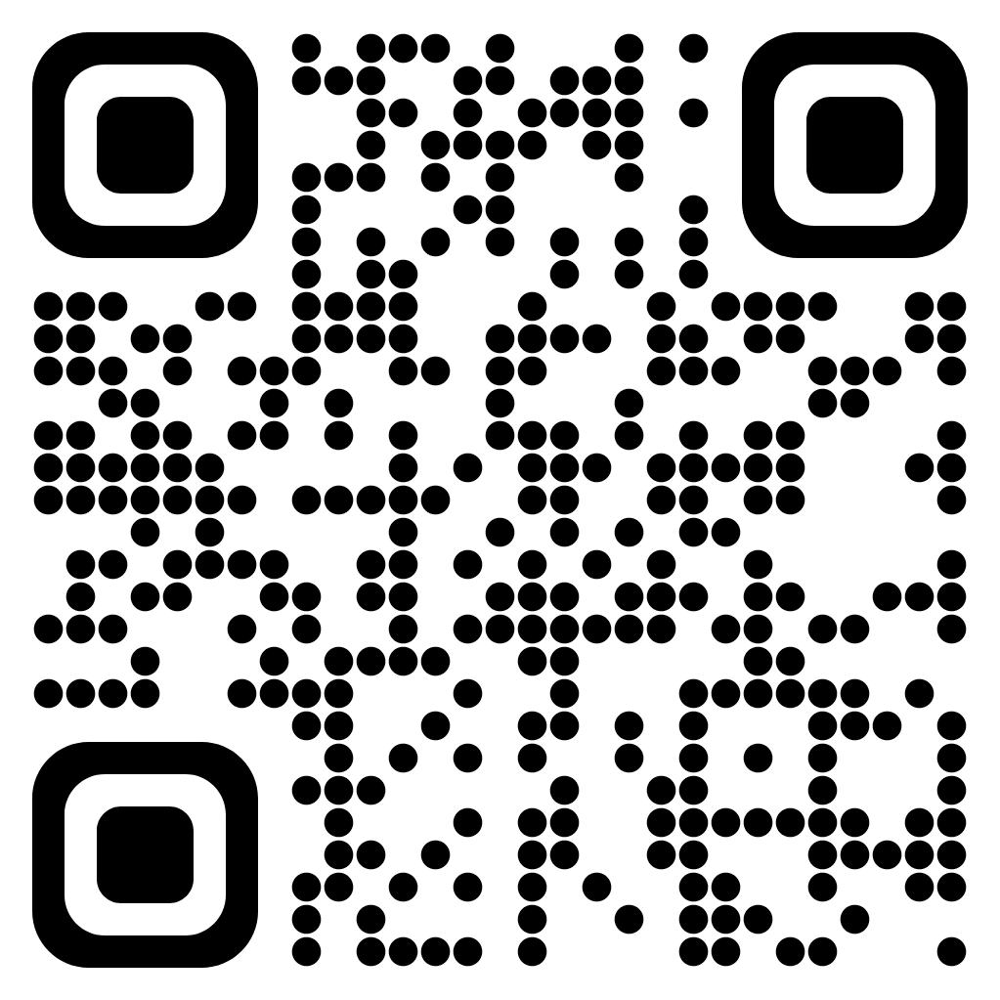
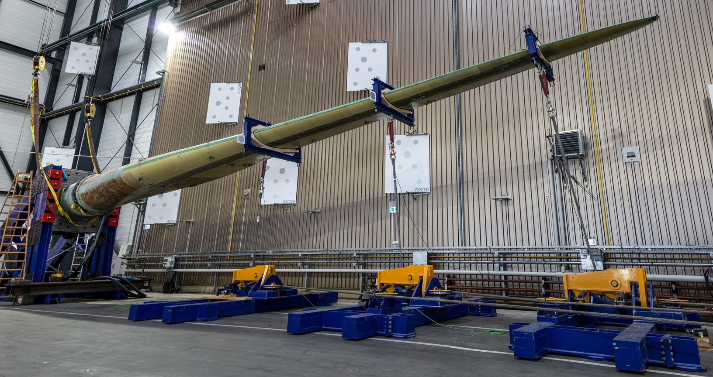
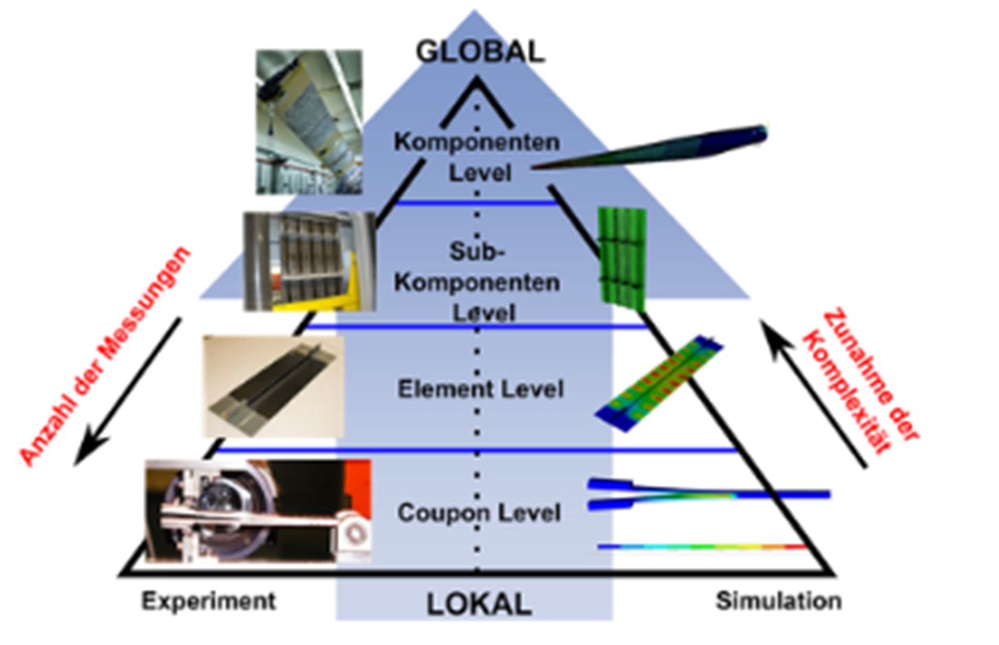
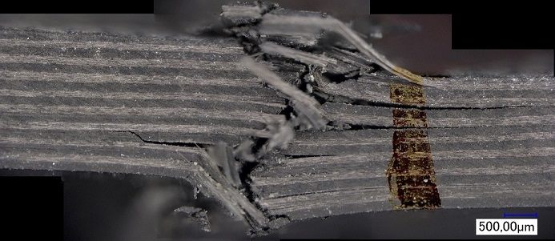
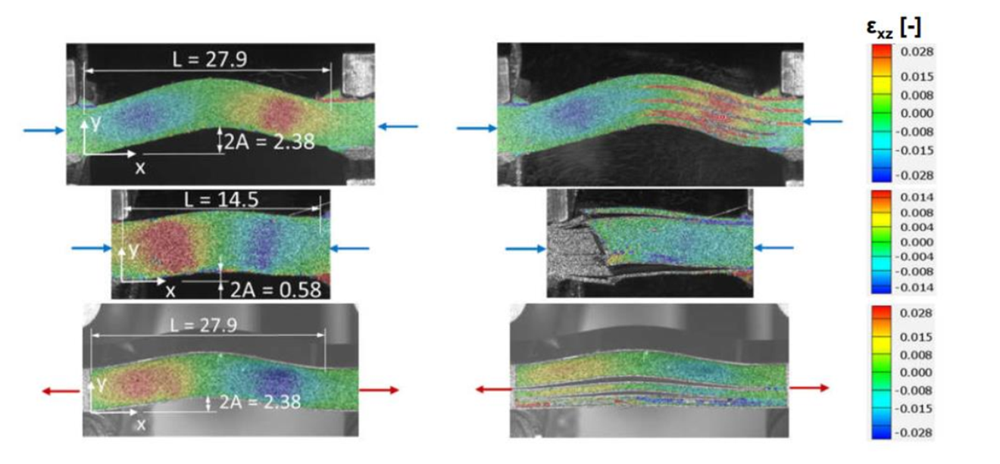
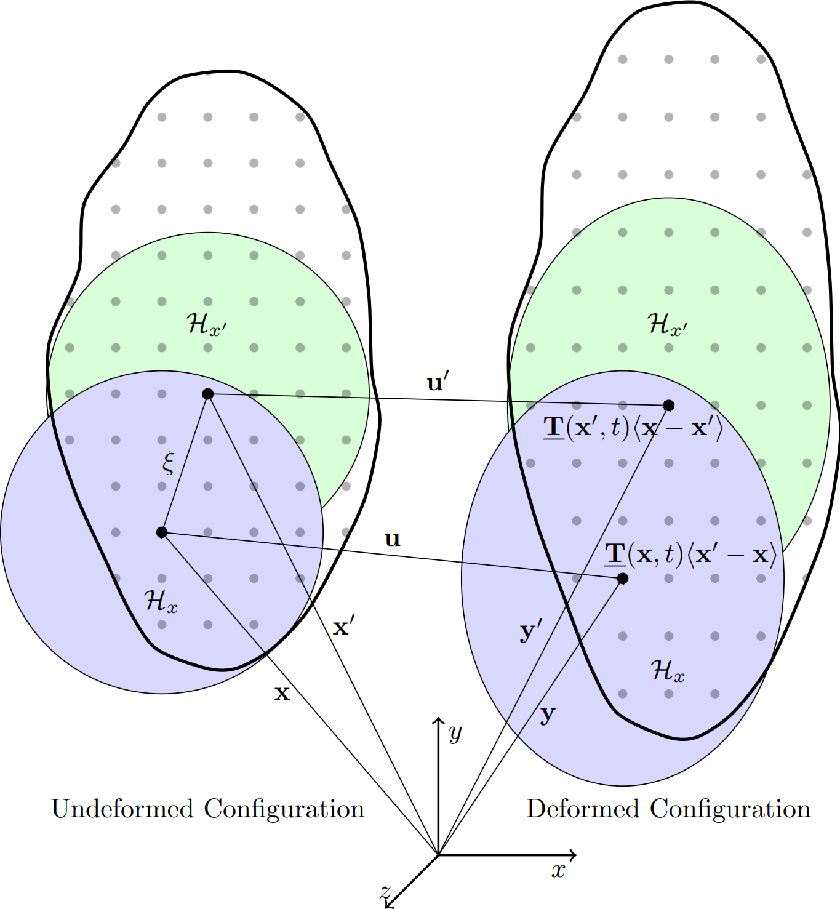
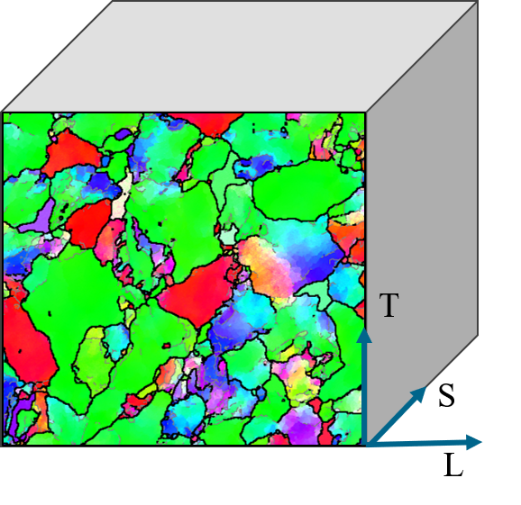
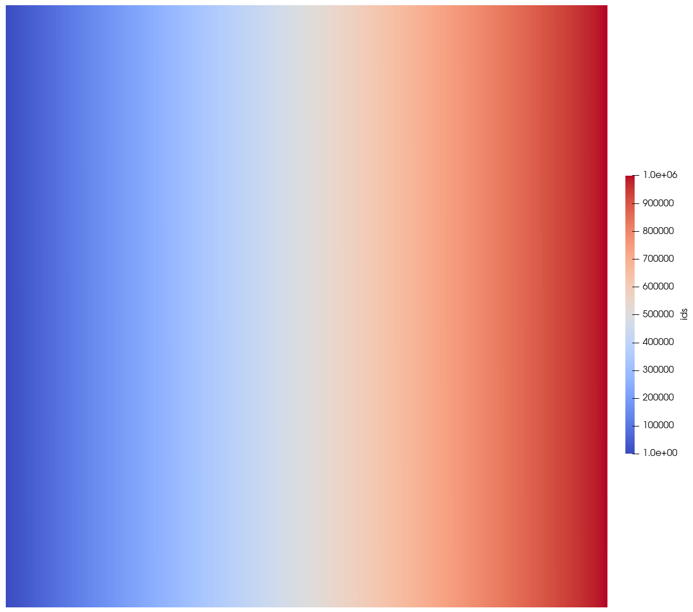
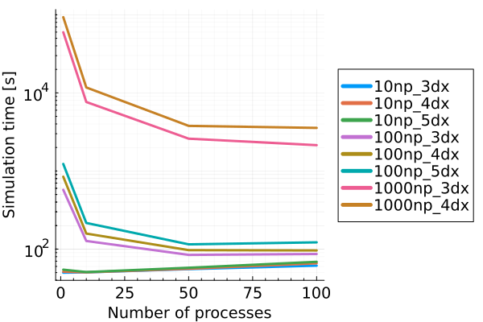

<!-- _class: title-slide -->

# Modellierung von Schädigungsmechanismen

  

Christian Willberg

Antrittsvorlesung Hochschule Magdeburg-Stendal HS 2, 08.10.2024, Magdeburg

<!---
- not the typical computational engineering presentation
- algorithms are impresive, but we asked ourself, why so few algorithms reach the productive phase
-  are our results in paper realy reproducible?
- We discuss all the time about fast algorithms and run time but -> next slide
-->

<!--paginate: true-->
<!--footer: 'https://github.com/PeriHub/Presentations/tree/master/Antrittsvorlesung'-->

---

## Leichtbau und effizienter Ressourceneinsatz

- große Zahl von Variationen
- Experimente sind teuer
- Zuverlässigkeit

---
## Testpyramide

---

## Mikrostruktur

- Mikrostruktur beeinflusst die Initiierung
- Simulationen und Experimente zum Ableiten von Kennwerten für die Mesoskala

---
## Klassische Modellierung
- klassische Kontinuumsmechanische Formulierung $\text{div}(\mathbf{\sigma})+\textbf{b} =\rho\ddot{\textbf{u}}$
- Approximation der partiellen DGL mittels der Finiten Elemente Methode
- Zentrale Annahme:
  - $C^1$ Stetigkeit des Verschiebungsfeldes

---

## Problem der unendlichen Spannungen
  - Interfaces
  - Rissspitzen
  - Ecken

---

## Peridynamics (PD)

$\int_{\mathcal{H}}(\underline{\textbf{T}}(\textbf{x},t)
\underline{\textbf{T}}(\textbf{x}',t))dV_{\textbf{x}}+\textbf{b} =\rho\ddot{\textbf{u}}$

---

## Peridynamics (PD)

$$\mathbf{F}=\left[\int\limits_{\mathcal{H}}\underline{\omega}\langle 
\boldsymbol{\xi}\rangle\underline{\mathbf{Y}}\langle 
\boldsymbol{\xi}\rangle\otimes\underline{\mathbf{X}}\langle 
\boldsymbol{\xi}\rangle dV_{\textbf{x}}\boldsymbol{\xi}\right]\cdot \mathbf{K}^{-1}$$

$$\mathbf{K}=\int\limits_{\mathcal{H}}\underline{\omega}\langle 
\boldsymbol{\xi}\rangle\underline{\mathbf{X}}\langle 
\boldsymbol{\xi}\rangle\otimes\underline{\mathbf{X}}\langle 
\boldsymbol{\xi}\rangle dV_{\textbf{x}}$$ 

$$\underline{\mathbf{T}}\langle \boldsymbol{\xi}\rangle = 
\underline{\omega}\langle 
\boldsymbol{\xi}\rangle\mathbf{P}\mathbf {K}^{ -1 } \boldsymbol { \xi }\quad\text{with}\quad\mathbf{P}=\text{det}\mathbf{F}\boldsymbol{\sigma}\mathbf{F}^{
-1}$$

---
## Beispiele

- Anisotropie in Metallen
- Additive Fertigung

---

## Geschiedete Bautteile

<!--footer: 'EBSD Scans by: Otto Fuchs'
_class: cols-2 -->
<!-- -Electron backscatter diffraction
-Grain structure of an alluminium alloy
- -->

  ### Isotropic

  

  ### Anisotropic

  

---

<!--footer: ''
_class: cols-2 -->
<!-- -Electron backscatter diffraction
-Grain structure of an alluminium alloy
- -->

# Experimentelle Ergebnisse

---

## KIC $45\degree$ Specimen | PeriLab Ergebnisse

<iframe src="https://perilab-results.nimbus-extern.dlr.de/models/ForgedCT?step=10&variable=von Mises Stress&displFactor=20" width="1150" height="600"></iframe>

---

## Additive Fertigung

<iframe src="https://perilab-results.nimbus-extern.dlr.de/models/RVE?step=25&variable=Displacements&displFactor=100"
      width="1150" height="600"></iframe>

---

  <video src="./assets/zeiss_topics_aramis-high-speed_buckling-compression.mp4" controls width="90%"></video>

## Performanc
-a
-a
-d
-a
-g
-f
-g
-5
-5
-8

  

    

      
    

  

  

  

    
  

---
## Conclusio
- modern language should be preferred if new projects are started
- Julia is a great alternative to C++ and for PhD students easier to learn and to handle
- installation time was reduced to minutes from hours (if it even works)
- more user focussed developement

---
## Upcomming
- Coupled PD-FEM
- Axissymmetric
- New solver
- ...

    
---

## Danke für die Aufmerksamkeit
Christian Willberg: Magdeburg-Stendal University of Applied Sciences 
christian.willberg@h2.de

    

