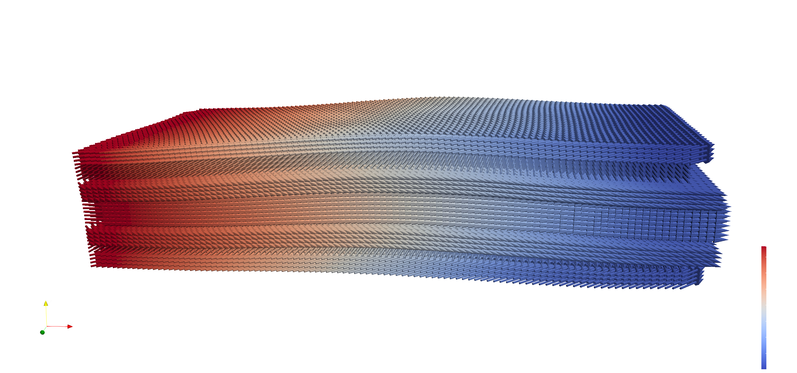

<!-- _class: title-slide -->

## Introduction to PeriHub

 
    

Jan-Timo Hesse, Christian Willberg
 

> <a href="https://sites.google.com/usacm.org/pd25/home" style="color: black; text-decoration: underline;">PeriHub - Empowering Research with Peridynamic Modeling</a> 
> _October 8th, 2024, Braunschweig_

Presentation URL: https://perihub.github.io/Presentations/PERIHUB

---

<!--paginate: true-->
<!--footer: 'Pres. URL: https://perihub.github.io/Presentations/PERIHUB'-->

## PeriHub

- Metals
- Compressive force
- Alluminium alloy:
  - High tensile strength
  - Applications in aerospace

---

## Generate model

---

<iframe src="https://perilab-results.nimbus-extern.dlr.de/models/Dogbone?step=36&variable=von%20Mises%20Stress" width="1150" height="600"></iframe>

---

## Analyse fracture

---

## Composite

---

# Thank you

[Jan-Timo Hesse](mailto:jan-timo.hesse@dlr.de) (DLR)
[Christian Willberg](christian.willberg@h2.de) (h2)

---