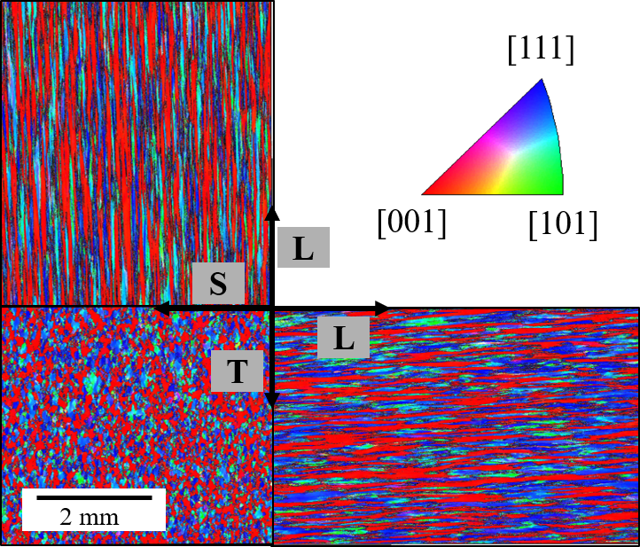
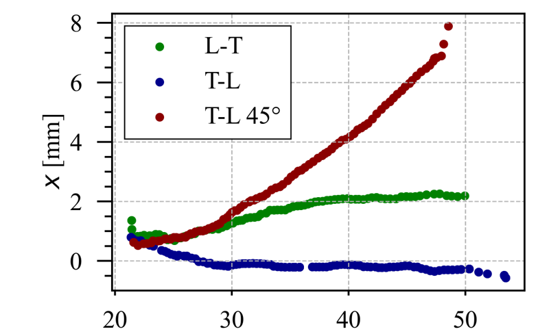
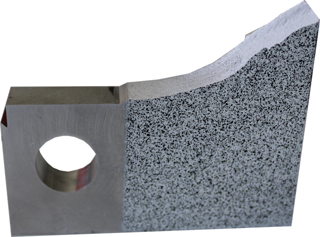
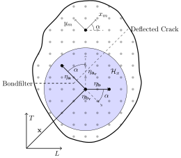
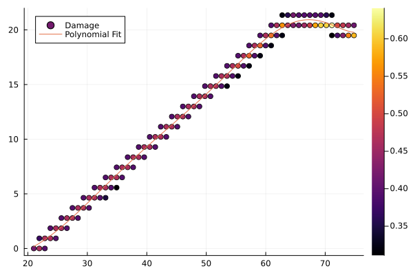

<!-- _class: title-slide -->

## Advanced Peridynamics Modeling for Predicting Anisotropic Crack Growth in Forged Materials

 
    

Jan-Timo Hesse, Christian Willberg</a>, Eric Breitbarth and Florian Paysan
 

> <a href="https://sites.google.com/usacm.org/pd25/home" style="color: black; text-decoration: underline;">USACM Thematic Conference, Quarter Century of Peridynamics</a> 
> _April 23th to 25th, 2024, Tucson_

Presentation URL: https://perihub.github.io/Presentations

---
<!--paginate: true-->

## Forged Components

- Metals
- Compressive force
- Alluminium alloy:
  - High tensile strength
  - Applications in aerospace

---
<!--footer: 'EBSD Scans by: Otto Fuchs'
_class: cols-2 -->

## Forged Components

## Isotropic

## Anisotropic

---

<!--footer: 'EBSD Scans by: Otto Fuchs'
_class: cols-2 -->

- Highly diverse material properties due to forging process.
- Anisotropic damage behavior depends on material orientations.
- Time and cost-consuming identification of material properties

## Orientations

---

<!--footer: 'Specimen Geometry: ASTM E647-15'
_class: cols-2 -->

## Compact Tension Specimen

| Parameter | Value  |
| --------- | ------ |
| $W$       | $75mm$ |
| $B$       | $12mm$ |
| $a$       | $21mm$ |

---

<!--footer: ''
_class: cols-2-->

# Experimental Setup

## Material: AA7010-T7452

| Orientation       | KIC $[MPa\sqrt{m}]$ |
| ----------------- | ------------------- |
| **L-T**           | $37.44$             |
| _T-L_ $45\degree$ | $\mathit{36.21}$    |
| **T-L**           | $21.24$             |

## Loading Force

| Parameter | Value   |
| --------- | ------- |
| $F_{max}$ | $4.5kN$ |
| $R$       | $0.1$   |
| $f$       | $20Hz$  |

---

<!--footer: 'Video by: Carl Zeiss GOM Metrology GmbH'-->

## ARAMIS High-Speed DIC Systems

<iframe src="https://www.gom.com/-/media/gom-website/global/topics/aramis-high-speed-dic-systems/gom_aramis-high-speed_buckling_high_speed_compression_video.mp4" width="963" height="542"></iframe>

---

<!--footer: ''
_class: cols-2-->

# Experimental Results

---

# Peridynamics

## Energy-based damage model by Foster

$$
\begin{align}
w_C&= \frac{4G_0}{\pi\delta^4} \qquad\qquad \tag{1}\label{eq:wc}\\
\chi(\underline{e}\langle\xi\rangle,t)&=
  \begin{cases}
      1,  & \text{if } w(\underline{e}\langle\xi\rangle) > w_C \\
      0,  & \text{otherwise}
  \end{cases} \tag{2}\label{eq:chi}\\
w &= \int_\eta (\mathbf{\underline{T}}[x,t]\langle x'-x\rangle - \mathbf{\underline{T}}[x',t]\langle x-x'\rangle)d\eta \tag{3}\label{eq:w}\\
\end{align}
$$

---

<!-- _class: cols-2 -->

## Damage

- Material orientation angle $\alpha = 45\degree$
- Inverse rotation of Bonds $\eta_a$ and $\eta_b$
- Projection of $\eta_a$ and $\eta_b$ in the $x$ and $y$ directions

| Bond                       | Bond components |
| -------------------------- | --------------- |
| $(\eta_{a_x}, \eta_{b_y})$ | $(0,1)$         |
| $(\eta_{b_x}, \eta_{b_y})$ | $(0.5,0.5)$     |

---

## Advanced energy-based damage model

$$
\begin{align}
w_C(\alpha)&= \frac{4G_0(\alpha)}{\pi\delta^4} \tag{4}\label{eq:wca}\\
\mathbf{\eta}_{Rot}&= R^{-1}(\alpha)\mathbf{\eta} \tag{5}\label{eq:eta}\\
(\eta_x, \eta_y)&= \frac{|\eta_{Rot_x}|}{||\mathbf{\eta}||} \tag{6}\label{eq:etax}\\
w(\underline{e}\langle\xi\rangle,\alpha)&= w(\underline{e}\langle\xi\rangle)(\eta_x, \eta_y) \tag{7}\label{eq:we}\\
\chi(\underline{e}\langle\xi\rangle,t,\alpha)&=
\begin{cases}
    1,  & \text{if } w(\underline{e}\langle\xi\rangle,\alpha) > w_C(\alpha) \\
    0,  & \text{otherwise}
\end{cases} \tag{8}\label{eq:chia}
\end{align}
$$

---
<!--footer: 'PeriLab Repository: https://github.com/PeriHub/PeriLab.jl'-->
<!-- _class: cols-2 -->

# PeriLab - Peridynamic Laboratory

- 🔑 **Open Source**

- 🚀 **Easy Installation**

- ✒️ **Modularization**

- 🔥 **Additive Manufacturing**

- 🧲 **Multiphysics**

- 💻 **HPC capabilities**

- 📤📥 **Exodus Input/Output**

- 🧮 **Abaqus Input**

quadrantChart
  x-axis Low Functionalty --> High Functionalty
  y-axis Hard to use --> Simple to use
  Peridigm: [0.85, 0.2]
  PeriLab: [0.5, 0.8]
  EMU: [0.95, 0.1]
  PeriPy: [0.2, 0.7]
  PeriPyDIC: [0.2, 0.6]
  LAMMPS: [0.3, 0.3]
  PeriFlakes: [0.35, 0.4]
  Relation-Based Software: [0.4, 0.25]
  BB_PD: [0.2, 0.50]
  PeriDEM: [0.13, 0.3]

---
<!--footer: 'Results: https://perilab-results.nimbus-extern.dlr.de/models/ForgedCT'-->

## Compact Tension $45\degree$ Specimen 

<iframe src="https://perilab-results.nimbus-extern.dlr.de/models/ForgedCT?step=199&variable=Damage&displFactor=20" width="1150" height="600"></iframe>

---

<!--footer: 'Julia Script: https://github.com/PeriHub/PeriLab.jl/blob/main/scripts/crack_path.jl'-->
<!-- _class: cols-2 -->

# Crack Path

## Compact Tension

| Orientation     | KIC $[MPa\sqrt{m}]$ |
| --------------- | ------------------- |
| L-T             | $37.44$             |
| T-L $45\degree$ | $36.21$             |
| T-L             | $21.24$             |

---
<!--footer: 'Results: https://perilab-results.nimbus-extern.dlr.de/plots/ForgedCTCrack'-->

## Compact Tension Crack Path

<iframe src="https://perilab-results.nimbus-extern.dlr.de/plots/ForgedCTCrack" width="1150" height="600"></iframe>

---
<!--footer: ''-->

## Discussion and further

- Material Models ➡️ Plasticity
- Discretization and non uniform mesh
- Sensitivity Analysis

---

## Thank you

[Jan-Timo Hesse](mailto:jan-timo.hesse@dlr.de) (DLR)
[Christian Willberg](christian.willberg@h2.de) (h2)
[Eric Breitbarth](eric.breitbarth@dlr.de) (DLR)
[Florian Paysan](florian.paysan@dlr.de) (DLR)

---

## References

1. [Foster, John & Silling, Stewart & Chen, Weinong. (2011). An energy based failure criterion for use with peridynamic states.](http://dx.doi.org/10.1615/IntJMultCompEng.2011002407)
2. [Willberg, Christian & Wiedemann, Lasse & Rädel, Martin. (2019). A mode-dependent energy-based damage model for peridynamics and its implementation.](https://doi.org/10.2140/jomms.2019.14.193)
3. [Willberg, Christian & Hesse, Jan-Timo & Pernatii, Anna. (2024). PeriLab - Peridynamic Laboratory.](https://doi.org/10.1016/j.softx.2024.101700)

---

## Funding

|Name|Logo|Grant number|
|--|--|--|
|[Deutsche Forschungsgemeinschaft](https://www.dfg.de/)||[WI 4835/5-1](https://gepris.dfg.de/gepris/projekt/456427423)|
|[Saxon state parlament](https://www.landtag.sachsen.de/de)||[3028223](https://www.m-era.net/materipedia/2020/emma)|
|[Federal Ministry for Economic Affairs and Climate Action](https://www.bmwk.de/Navigation/DE/Home/home.html)||20W2214G|