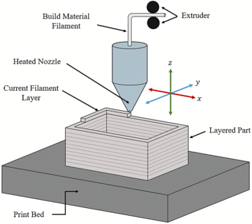
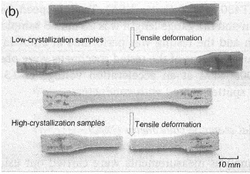

<!-- _class: title-slide -->

## Multiphysics Simulation of Additive Manufacturing-Induced Fracture Mechanics using Peridynamic Theory 

 
    

Jan-Timo Hesse, Christian Willberg, Felix Winkelmann, Robert Hein
 

> <h style="color: black; ">18th International Conference on Computational Plasticity - COMPLAS 2025</h> 
> _2-5 September, 2025 - Barcelona_

Presentation URL: https://perihub.github.io/Presentations/COMPLAS_2025

---

<!--header: '

  
    <iframe src="https://app.sli.do/event/iZoQmywsAFqX7iApJ5f8sp" width="500px" height="600px" style="border: 0;"></iframe>
  

Questions

'-->
<!--paginate: true-->
<!--footer: 'https://perihub.github.io/Presentations/COMPLAS_2025'-->

# Introduction 3D printing

- Additive extrusion processes enables manufacturing of complex structures without moulds

- Many process parameters influence the final properties
    - Individual process parameter - property relation often unclear 

- Process simulations can help to predict the properties and evaluate the process parameters
 

 
    Quelle: Shah, J., Snider, B., Clarke, T. et al. Large-scale 3D printers for additive manufacturing: design considerations and challenges. Int J Adv Manuf Technol 104, 3679–3693 (2019). https://doi.org/10.1007/s00170-019-04074-6 

---

# Introduction polymer crystallization

- Crystallization influences the mechanical and technical properties of the material

- Degree of crystallization depends on material properties and cooling conditions

- Complex processes during cooling in deposition processes

Quelle: [2] Influence of thermal processing conditions in 3D printing on the crystallinity and mechanical properties of PEEK material, Yang,Tian,Li et. al. , Journal of Materials Processing Tech., 2017 

 

---
# Subroutine 

-  Calculation of crystallization based on dual kinetic model (by Velisaris Seferis ggf. Tonspur)

- Implementation in Fortran Subroutine for usage in Abaqus
  - Calculates crystallization kinetics through process simulation
  - Degree of crystallization at every time step 

- Temperature and time from the process simualtion are inputs for the subroutine  

---

<!-- _class: section-slide-vulcan -->

## Experiment

---

<!--footer: 'Specimen Geometry: ASTM E647-15'-->

# Dogbone Specimen

---

<!--footer: ''
_class: cols-2-1-->

# Experimental Setup

## Material: PEEK???

| Parameter     | Value                |
| ------------- | -------------------- |
| $E$           | $3800\ MPa$         |
| $\nu$         | $0.33$               |

## Thermal Properties

| Parameter | Value     |
| --------- | --------- |
| $\kappa$ | $0.12$ |
| $h$       |$15.0\times 10^{-3} \frac{W}{m^2K}$|
| $T_P$       | $653.15K$     |
| $T_E$       | $293.15K$  |

$F(t) = -2025 * sin(2 * pi * 20 * t - pi / 2) -2475$

---

<!-- _class: section-slide-rocket -->

## Experimental Results

---

# Experimental Results
 
<iframe width="95%" height="95%" src="https://www.youtube-nocookie.com/embed/8V8CkSvO0Ok?si=2roU3VJ4qxuXFLeV" title="YouTube video player" frameborder="0" allow="accelerometer; autoplay; clipboard-write; encrypted-media; gyroscope; picture-in-picture; web-share" referrerpolicy="strict-origin-when-cross-origin" allowfullscreen></iframe>

---

<!--footer: 'Results: https://perilab-results.nimbus-extern.dlr.de/models/ForgedCT'-->

## Dogbone Specimen | PeriLab Results

<iframe src="https://perilab-results.nimbus-extern.dlr.de/models/ForgedCT?step=10&variable=von Mises Stress&displFactor=20" width="1150" height="600"></iframe>

---

<!--footer: ''-->

# Load-Displacement

<iframe src="assets/plot.html" width="95%" height="95%" style="border: 0; margin-left: 70px"></iframe>

---

<!--header: ''-->

# Questions

<iframe src="https://app.sli.do/event/iZoQmywsAFqX7iApJ5f8sp" width="90%" height="85%" style="border: 0; margin-left: 70px"></iframe>

---

<!--footer: ''-->
<!-- _class: cols-2 -->
<!-- -We could determine three diferent failure mechanisms by looking at the crack surface-->

## Discussion and further work

- Lorum

---

# Thank you

[Jan-Timo Hesse](mailto:jan-timo.hesse@dlr.de) (DLR)
[Christian Willberg](mailto:christian.willberg@h2.de) (h2)
[Felix Winkelmann](mailto:felix.winkelmann@dlr.de) (DLR)
[Robert Hein](mailto:robert.hein@dlr.de) (DLR)

---

# References

1. [Foster, John & Silling, Stewart & Chen, Weinong. (2011). An energy based failure criterion for use with peridynamic states.](http://dx.doi.org/10.1615/IntJMultCompEng.2011002407)
2. [Willberg, Christian & Wiedemann, Lasse & Rädel, Martin. (2019). A mode-dependent energy-based damage model for peridynamics and its implementation.](https://doi.org/10.2140/jomms.2019.14.193)
3. [Willberg, Christian & Hesse, Jan-Timo & Pernatii, Anna. (2024). PeriLab - Peridynamic Laboratory.](https://doi.org/10.1016/j.softx.2024.101700)

---

## Funding

| Name                                                                                                         | Logo                                                                                                                 | Grant number                                                  |
| ------------------------------------------------------------------------------------------------------------ | -------------------------------------------------------------------------------------------------------------------- | ------------------------------------------------------------- |
| [German Research Foundation](https://www.dfg.de/)                                                            |      | [WI 4835/5-1](https://gepris.dfg.de/gepris/projekt/456427423) |
| [Saxon State Parliament](https://www.landtag.sachsen.de/de)                                                  |  | [3028223](https://www.m-era.net/materipedia/2020/emma)        |
| [Federal Ministry for Economic Affairs and Climate Action](https://www.bmwk.de/Navigation/DE/Home/home.html) |   | 20W2214G                                                      |
