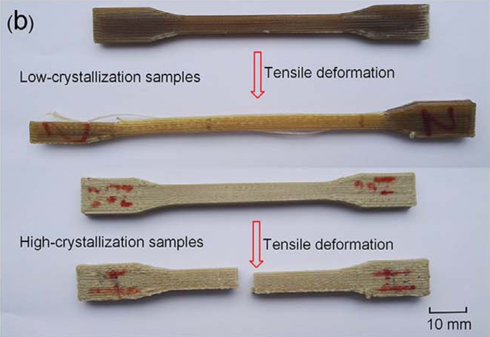

<!-- _class: title-slide -->

## Multiphysics Simulation of Additive Manufacturing-Induced Fracture Mechanics using Peridynamic Theory 

 
    

Jan-Timo Hesse, Christian Willberg, Felix Winkelmann, Robert Hein
 

> <h style="color: black; ">18th International Conference on Computational Plasticity - COMPLAS 2025</h> 
> _2-5 September, 2025 - Barcelona_

Presentation URL: https://perihub.github.io/Presentations/COMPLAS_2025

---

<!--header: '

  
    <iframe src="https://app.sli.do/event/iZoQmywsAFqX7iApJ5f8sp" width="500px" height="600px" style="border: 0;"></iframe>
  

Questions

'-->
<!--_class: cols-2-->
<!--paginate: true-->
<!--footer: 'https://perihub.github.io/Presentations/COMPLAS_2025'-->

# Introduction 3D printing

- Additive extrusion processes enables manufacturing of complex structures without moulds

- Many process parameters influence the final properties
    - Individual process parameter - property relation often unclear 

- Process simulations can help to predict the properties and evaluate the process parameters

---
<!--_class: cols-2-->
<!--footer: Figure Source: Yang et al., Influence of thermal processing conditions in 3D printing ...-->

# Introduction polymer crystallization

- Crystallization influences the mechanical and technical properties of the material

- Degree of crystallization depends on material properties and cooling conditions

- Complex processes during cooling in deposition processes

 

---
<!--footer: ''-->
# Subroutine 

-  Calculation of crystallization, dual kinetic model (by Velisaris & Seferis)

- Implementation in Fortran HETVAL Subroutine for usage in Abaqus
  - Calculates crystallization kinetics through process simulation
  - Degree of crystallization at every time step 

- Temperature and time from the process simualtion are inputs for the subroutine  

- Stiffness value $E$ of each node will be adapted based on the degree of crystallization

- Fitting function: $X_{VC} =X_{VC\infty}(w_1F_{\theta1}(k)+w_2F_{\theta2}(k))$

---

<!-- _class: section-slide-vulcan -->

## Simulation

---

## What is Peridynamics?

- Alternative to classcical continuum mechanics: $\text{div}(\mathbf{\sigma})+\textbf{b} =\rho\ddot{\textbf{u}}$
- PD integral equation:
  $\int_{\mathcal{H}}(\underline{\textbf{T}}(\textbf{x},t)- \underline{\textbf{T}}(\textbf{x}',t))dV_{\textbf{x}}+\textbf{b} =\rho\ddot{\textbf{u}}$
- Focus material modeling and crack propagation; no $C^1$ continuity for the displacement

---

## PD Solving the integral - Material point method

__Advantages__  
- Fast to implement
- Failure propagation
- Discretization

__Diadvantages__  
- Convergence is lower
- Surfaces are not known

---

<!--_class: cols-2-->

# Peridynamic Framework (PeriLab)

- No pre-processing required, mesh will be generated based on the gcode
- Material Models:
  - PD Solid Elastic/Plastic
- Thermal Models:
  - Thermal Flow
  - Heat Transfer
  - HETVAL subroutine
- Damage Models:
  - Critical Stretch

---

<!--footer: 'Specimen Geometry: ASTM D638'-->

# Dogbone Specimen

- Three step simulation process:
  - Printing specimen
  - Cooling step
  - Tensile test
- Layer height = 0.2mm  (20 Layers)

---

<!--footer: ''
_class: cols-2-1-->

# Simulation Properties

## Material: PEEK (Polyetheretherketon)

| Parameter     | Value        |
| ------------- | -------------|
| $E$           | $3800\ MPa$  |
| $\nu$         | $0.33$       |
| $\rho$        | $1240\times 10^{-12} \frac{t}{mm^3}$|
|$s_c$          | $0.12$        |   

## Thermal Properties

| Parameter | Value     |
| --------- | --------- |
| $\kappa$  | $0.12$ |
| $h$       | $15.0\times 10^{-3} \frac{t}{s^3K}$ |
| $T_P$     | $653.15K$ |
| $T_{RT}$  | $293.15K$ |
| $c$       | $1800.0\times 10^{6} \frac{mm^2}{s^2K}$ |

$T_E = [473.15K; 423.15K; 373.15K; 293.15K]$

---

<!-- _class: section-slide-rocket -->

## Simulation Results

---

# Simulation Results
 
<iframe width="1150" height="500" src="https://www.youtube.com/embed/dGfJG9AoL4g?si=22l_pryTfsmBexXY" title="YouTube video player" frameborder="0" allow="accelerometer; autoplay; clipboard-write; encrypted-media; gyroscope; picture-in-picture; web-share" referrerpolicy="strict-origin-when-cross-origin" allowfullscreen></iframe>

---

## Simulation Results

- Crack initiation and propagation simliar, only initiation time slightly differs

---

<!--footer: ''-->

# Load-Displacement

<iframe src="assets/plot.html" width="95%" height="95%" style="border: 0; margin-left: 70px"></iframe>

---

# Discussion and further work

- Basic influence of different process parameters can be captured
- PeriLab allows efficient and statistical analysis of the AM process

- Verification with experiments
- Variation of diverse process parameters
- Influence of printbed

---

<!--header: ''-->

# Thank you!

[Jan-Timo Hesse](mailto:jan-timo.hesse@dlr.de) (DLR)
[Christian Willberg](mailto:christian.willberg@h2.de) (h2)
[Felix Winkelmann](mailto:felix.winkelmann@dlr.de) (DLR)
[Robert Hein](mailto:robert.hein@dlr.de) (DLR)

---
# Questions

<iframe src="https://app.sli.do/event/iZoQmywsAFqX7iApJ5f8sp" width="90%" height="85%" style="border: 0; margin-left: 70px"></iframe>

---

# References

1. [J. Shah, B. Snider, T. Clarke, S. Kozutsky, M. Lacki & A. Hosseini (2019). Large-scale 3D printers for additive manufacturing: design considerations and challenges.](https://doi.org/10.1007/s00170-019-04074-6 )
2. [C. Yang, X. Tian, D. Li, Y. Cao, F. Zhao & C. Shi (2017). Influence of thermal processing conditions in 3D printing on the crystallinity and mechanical properties of PEEK material.](https://doi.org/10.1016/j.jmatprotec.2017.04.027)
4. [C. Willberg, J-T. Hesse, R. Hein & F. Winkelmann (2024). Peridynamic Framework to Model Additive Manufacturing Processes.](https://doi.org/10.1002/adts.202400818)
4. [C. Willberg, J-T. Hesse & A. Pernatii (2024). PeriLab - Peridynamic Laboratory.](https://doi.org/10.1016/j.softx.2024.101700)

---

## Funding

| Name                                                                                                         | Logo                                                                                                                 | Grant number                                                  |
| ------------------------------------------------------------------------------------------------------------ | -------------------------------------------------------------------------------------------------------------------- | ------------------------------------------------------------- |
| [German Research Foundation](https://www.dfg.de/)                                                            |      | [WI 4835/5-1](https://gepris.dfg.de/gepris/projekt/456427423) |
| [Saxon State Parliament](https://www.landtag.sachsen.de/de)                                                  |  | [3028223](https://www.m-era.net/materipedia/2020/emma)        |
| [Federal Ministry for Economic Affairs and Climate Action](https://www.bmwk.de/Navigation/DE/Home/home.html) |   | 20W2214G                                                      |
