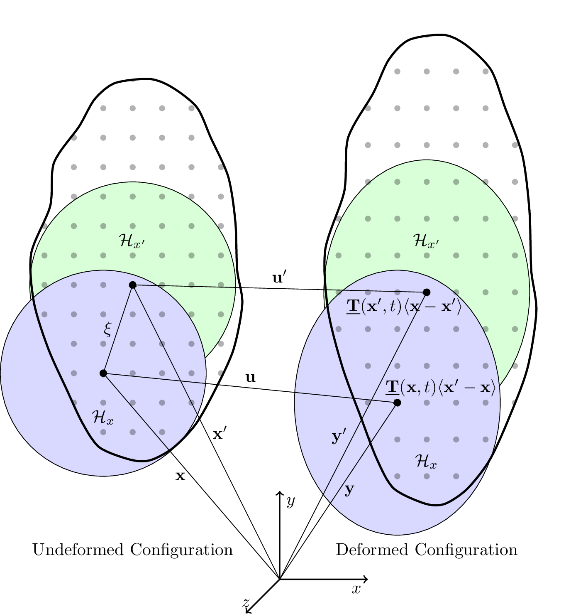
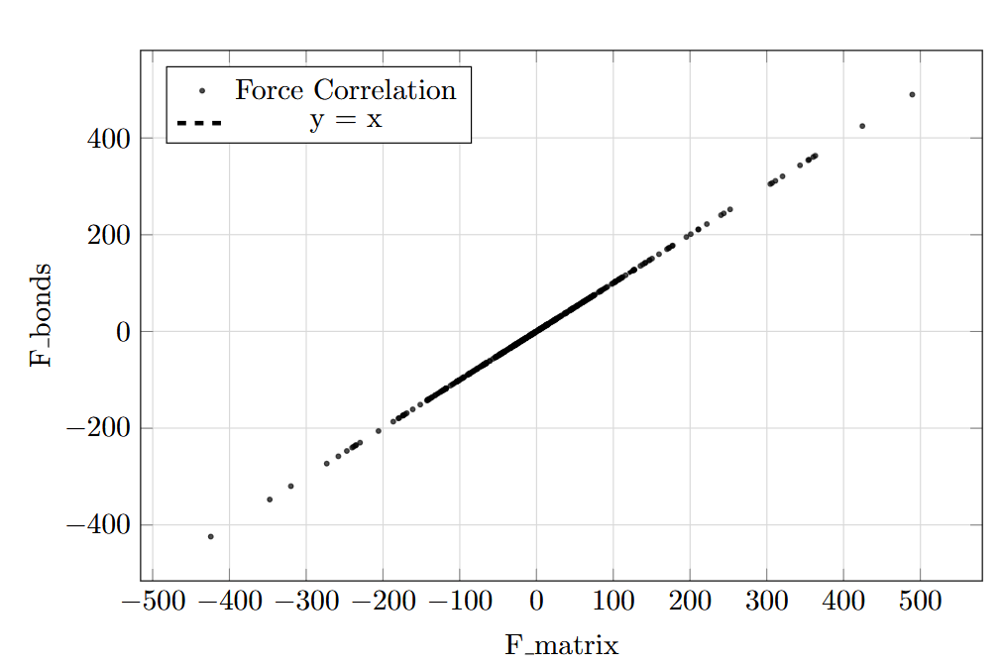
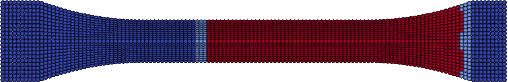
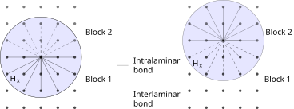
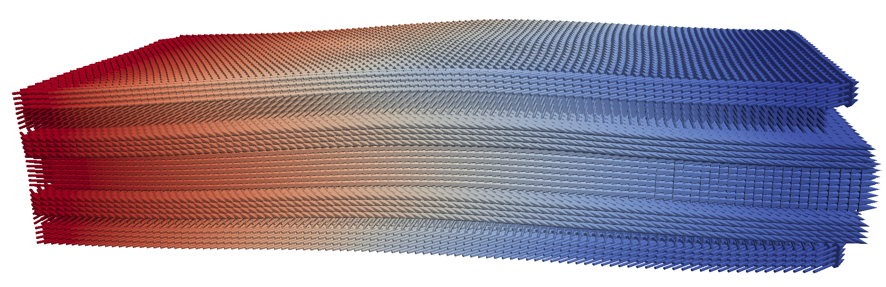
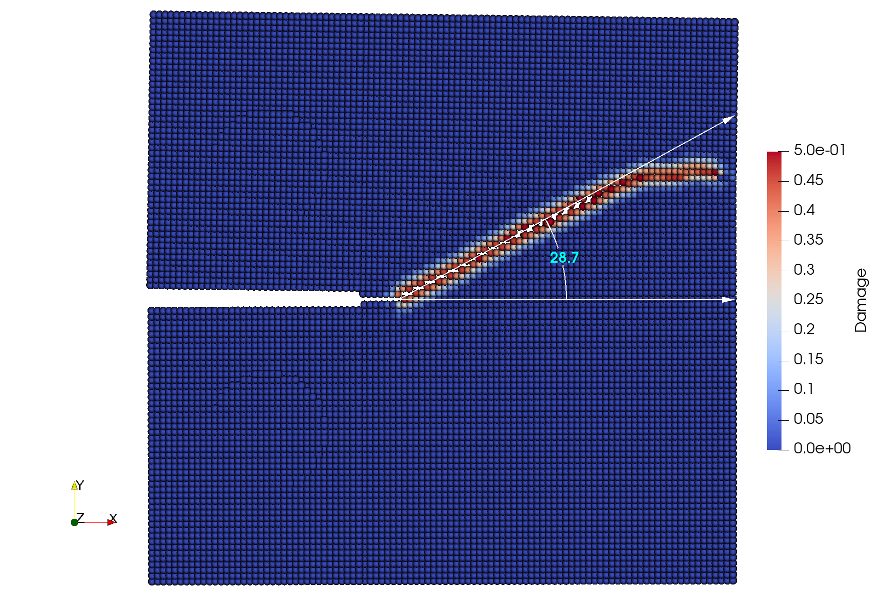
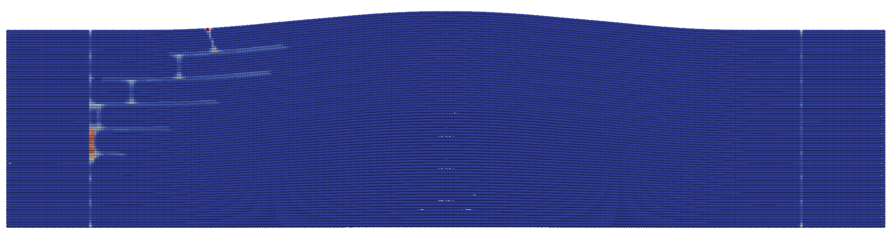
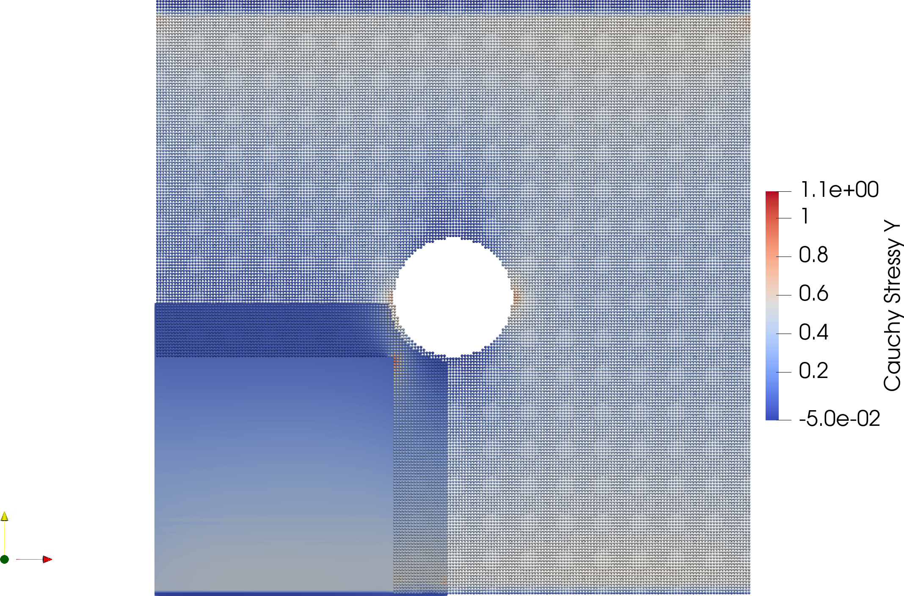
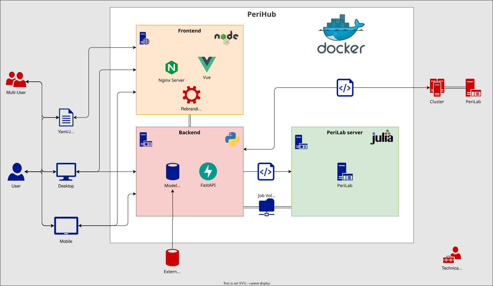

<script type="module">
  import mermaid from 'https://cdn.jsdelivr.net/npm/mermaid@10/dist/mermaid.esm.min.mjs';
  mermaid.initialize({ startOnLoad: true,
  theme: 'white',
  circular: {
    radius: 300,
    direction: 'CW',
  }, });
</script>

<!-- _class: title-slide -->

## PeriHub: An Overview of a Modern Simulation Framework for Non-Local Material Mechanics

<div style="position: absolute; top: 20px; left: 1050px;"> 
    
</div>

Jan-Timo Hesse<a href="https://orcid.org/0000-0002-3006-1520"></a>, Christian Willberg<a href="https://orcid.org/0000-0003-2433-9183"></a>
<br />

> <h style="color: black; ">FRASCAL - Virtual Colloquium </h> 
> _19th May, 2026_

<div style="position: absolute; bottom: 10px; left: 100px; color: grray; font-size: 20px;">
Presentation URL: https://perihub.github.io/Presentations/FRASCAL_2026
</div>

---

# Why a New Simulation Method?

<div class="cols">
<div>

**Classical continuum mechanics**

$$\operatorname{div}(\boldsymbol{\sigma}) + \mathbf{b} = \rho\ddot{\mathbf{u}}$$

- Requires spatial derivatives of $\boldsymbol{\sigma}$
- At cracks: derivatives **undefined**
- Cracks must be prescribed or tracked (XFEM, CZM)
- Mesh distortion → remeshing

</div>
<div>

## FEM
- method to approximate classical continuum mechanics
- cracks lead to infinite stresses, because no valid solution exists

</div>
</div>

---

# Peridynamics (PD)

$\int_{\mathcal{H}}\!\bigl(\underline{\mathbf{T}}\langle\boldsymbol{\xi}\rangle - \underline{\mathbf{T}}'\langle{-}\boldsymbol{\xi}\rangle\bigr)\,dV' + \mathbf{b} = \rho\ddot{\mathbf{u}}$

- Integral equation — no spatial derivatives
- Valid **across cracks**
- Cracks emerge naturally from material failure
- No remeshing needed



<div class="note">

Silling (2000): "<a href="https://www.sciencedirect.com/science/article/pii/S0022509699000290" target="_blank">Reformulation of elasticity theory for discontinuities and long-range forces.</a>"

</div>

---

# The Peridynamic Horizon

<div class="cols">
<div>

- Each point $\mathbf{x}$ interacts with all neighbours $\mathbf{x}'$ within horizon $\delta$
- **Reference bond:** $\boldsymbol{\xi} = \mathbf{x}' - \mathbf{x}$
- **Relative displacement:** $\boldsymbol{\eta} = \mathbf{u}' - \mathbf{u}$
- Damage: bond breaks, e.g. when stretch exceeds $s_c$

$$s = \frac{|\boldsymbol{\xi}+\boldsymbol{\eta}| - |\boldsymbol{\xi}|}{|\boldsymbol{\xi}|} > s_c$$

</div>
<div>

<div class="note">

**Key insight:** The horizon $\delta$ is a material length parameter. As $\delta \to 0$, peridynamics converges to classical continuum mechanics. No special crack tracking is needed — damage is a natural outcome.

</div>

| Horizon ratio $m = \delta/\Delta x$ | Effect |
|---|---|
| $m = 3$ | Good compromise |
| $m = 4{-}5$ | Better convergence |
| $m \to \infty$ and $\delta \to 0$ | Classical CM |

</div>
</div>

---

# From Bond-based to Correspondence

| Formulation | Key idea | Poisson's ratio | Anisotropy |
|---|---|---|---|
| Bond-based (BB) | Pairwise spring force | $\nu = 1/4$ fixed | No |
| Ordinary state-based (OSB) | Collective, central force | Arbitrary | No |
| Non-ordinary state-based (NOSB) | Deformation gradient $\mathbf{F}$ | Arbitrary | Yes |
| Correspondence (CCM) | $\mathbf{F}$ → classical $\boldsymbol{\sigma}$ | Arbitrary | Yes |

<div class="green">

**Correspondence model:** compute $\mathbf{F}$ from the PD neighbourhood, apply any classical material model to get $\boldsymbol{\sigma}$, convert back to PD force density state. Enables direct reuse of existing constitutive models.

</div>

---

# Correspondence — Core Equations

<div class="cols">
<div>

**Shape tensor** (computed once):
$$\mathbf{K} = \int_{\mathcal{H}} \underline{\omega}\,\underline{\mathbf{X}}\langle\boldsymbol{\xi}\rangle\otimes\underline{\mathbf{X}}\langle\boldsymbol{\xi}\rangle\,dV'$$

**Deformation gradient:**
$$\mathbf{F} = \!\left[\int_{\mathcal{H}} \underline{\omega}\, \langle\boldsymbol{\xi}\rangle\underline{\mathbf{Y}}\langle\boldsymbol{\xi}\rangle\otimes\underline{\mathbf{X}}\langle\boldsymbol{\xi}\rangle\,dV'\right]\mathbf{K}^{-1}$$

**Linearised strain:**
$$\boldsymbol{\varepsilon} = \tfrac{1}{2}(\mathbf{F}+\mathbf{F}^T) - \mathbf{I}$$

</div>
<div>

**Stress** (any classical model):
$$\boldsymbol{\sigma} = \mathbf{C}:\boldsymbol{\varepsilon}$$

**Force density state:**
$$\underline{\mathbf{T}}\langle\boldsymbol{\xi}\rangle = \underline{\omega}\,\boldsymbol{\sigma}\,\mathbf{K}^{-1}\boldsymbol{\xi}$$

**Equation of motion:**
$$\rho\ddot{\mathbf{u}} = \int_{\mathcal{H}}\!\bigl(\underline{\mathbf{T}}\langle\boldsymbol{\xi}\rangle - \underline{\mathbf{T}}'\langle{-}\boldsymbol{\xi}\rangle\bigr)\,dV' + \mathbf{b}$$

</div>
</div>

---

## PD Solving the integral - Material point method

__Advantages__  
- Fast to implement
- Failure propagation
- Discretization

__Disadvantages__  
- Convergence is lower
- Surfaces are not known


---

<!-- _class: section-slide-cfrp -->

## Peridynamic Framework (PeriLab)

---

<!--_class: cols-2-->

# Peridynamic Framework (PeriLab)

<div class=ldiv>

-  A high-performance, open-source peridynamic framework in Julia
- Designed to be extensible and modular, allowing users to easily add new features and solvers
- Built-in support for various material models and boundary conditions
- Support for multiphysics and multi-step simulations.
- Extensive documentation and community support
</div>
<div class=rdiv style="margin-top:80px">


</div>

---

# PeriLab — Design Philosophy

<div class="cols">
<div>

**Goal:** Reduce the entry barrier to peridynamic simulation

**Key decisions:**
- Julia as implementation language
- Package manager for all dependencies
- Macro-based module loading (no recompilation for new models)
- New material model: **1 file** (vs. 5+ in Peridigm)
- New input parameter: **in YAML** (vs. 6 files + recompile)
- MPI parallelism built in

</div>
<div>

| Criterion | Peridigm | PeriLab |
|---|---|---|
| Installation | Manual | Package manager |
| Build time | ~10 min | < 5 min |
| New material | 5+ files | 1 file |
| New parameter | 6 files + compile | YAML only |
| Libraries | Manual update | Automatic |
| Compilation knowledge | Deep | None |

</div>
</div>

---

# Why Julia?

<div class="cols">
<div>

**The two-language problem:**
- Prototype in Python (easy, slow)
- Rewrite in C++ for performance (hard, fast)
- Two codebases, two maintenance efforts

**Julia solves this:**
- Python-like syntax, C-like speed
- JIT compilation
- Native package manager (Pkg)
- First-class parallelism (MPI, threads)
- Easy to learn for PhD students

</div>
<div>

<div class="eq">

**Performance comparison**
(2×2 matrix inversion, inner loop)

| Method | Time |
|---|---|
| `inv(Matrix)` Julia | ~302 ns |
| `StaticArrays` Julia | ~2 ns |
| Equivalent C++ | ~2 ns |

</div>

<div class="note">

Julia achieves C-level performance with Python-level readability — without sacrificing either.

</div>

</div>
</div>

---

## Adding a New Material Model in PeriLab

```julia
# One file, one module — no recompilation of the core
module MyPlasticModel

using PeriLab

function compute_stress(strain, history, params)
    # your constitutive law here
    σ = params["E"] .* strain
    return σ, history
end
end
```

```yaml
# Reference in the YAML input deck — that is all
Material Models:
  MyMaterial:
    Material Model: MyPlasticModel
    E: 210000
```

<div class="note">

The macro system discovers and integrates the module at runtime. No changes to the core codebase, no recompilation, no deep knowledge of the solver internals required.
</div>

---

# Solver Overview

- **Verlet**
  - Explicit solver for non-linear problems
- **Static**
  - Static solver for linear problems
- **Matrix Verlet**
  - Efficient matrix-based explicit solver for non-linear problems
- **Matrix Linear Static**
  - Efficient matrix-based static solver for linear problems

---

## Matrix based approach

- Use correspondence stiffness matrix based on material point method

__Advantages__ 
- Linear static analysis possible
- Less operations per time step if Verlet is used

__Diadvantages__  
- Matrix update is costly
- Algorithms are more complex

<div class="note">

Hesse (2026): "<a href="https://www.sciencedirect.com/science/article/pii/S2352711026001378" target="_blank">Update (v2.0) to PeriLab - peridynamic laboratory</a>"

</div>



---

## Main Advantage

- Allows reduction methods
- Currently under development
- Static and dynamic reduction
- Currently under testing
- Split $\mathbf{K}_{mm}$ in material point part and matrix part
  - Allows easy implementation of fracture or non-linear material
  - Reduction of degrees of freedoms
 

---
<style scoped>
table {
    width: 100%;
    font-size: 24px;
}
</style>

# Module Overview

|Material|Damage|Thermal|Contact|Coupling|Additive|Degradation|
|---|---|---|---|---|---|---|
|Bond-Based|Critical Stretch|Thermal Flow|Penalty|FEM-PD|Damage-based|*Bond-based Corrosion*
|PD Solid Elastic/Plastic|Critical Energy|Heat Transfer|*Short-Range*|Guyan Reduction||*Thermal Decomposition*
|Correspondence Elastic/Plastic||Thermal Expansion|
|Correspondence UMAT/VUMAT||HETVAL|
|Bond Associated Correspondence|


---

## Temperature

- Convection
- Heat transfer
- Thermo-mechanical coupling


---

## Interblock damage

- Damage between layers or material
- Bonds handled differently if they exist in two blocks



---

# Input and Output Formats

<div class="mermaid">
%%{init: { 'theme':'forest','flowchart': { 'pointLabelFontSize': '130%'} } }%%
flowchart LR
    A[Text file] --> D{PeriLab}
    B[Exodus file] --> D
    C[Abaqus model] --> D
    D -->E[Exodus file]
    D -->F[CSV file]
</div>

---

<!-- _class: section-slide-plane -->

## Examples

---
# Examples - RVE

<br/>
<iframe width="1150" height="500" src="https://www.youtube.com/embed/ClV2ojQPrFM?si=eROuZGPdBpXTnmef" title="YouTube video player" frameborder="0" allow="accelerometer; autoplay; clipboard-write; encrypted-media; gyroscope; picture-in-picture; web-share" referrerpolicy="strict-origin-when-cross-origin" allowfullscreen></iframe>

---
# Examples - Impact
<br/>
<iframe width="1150" height="500" src="https://www.youtube.com/embed/qj7xGgmjEdE?si=wTN42HPnBmSPxwJ4" title="YouTube video player" frameborder="0" allow="accelerometer; autoplay; clipboard-write; encrypted-media; gyroscope; picture-in-picture; web-share" referrerpolicy="strict-origin-when-cross-origin" allowfullscreen></iframe>

---
# Examples - Additive
<br/>
<iframe width="1150" height="500" src="https://www.youtube.com/embed/dGfJG9AoL4g?si=-i41xB0_XemF87ts" title="YouTube video player" frameborder="0" allow="accelerometer; autoplay; clipboard-write; encrypted-media; gyroscope; picture-in-picture; web-share" referrerpolicy="strict-origin-when-cross-origin" allowfullscreen></iframe>

---

# Examples - Anisotropic Material



---

# Examples - Anisotropic Damage



---

# Examples - Interlaminar Failure



---

# Examples - FEM-Coupling



---

# Planned Features

- Dynamic solver switch
- Corrosive material models
- Performance and usability improvements
- More material and damage models 

---

<!-- _class: section-slide-vulcan -->

## PeriHub

---

# PeriHub


- **Peridynamic simulation engine** – extends PeriLab for detailed material‑science studies.  
- **Easy to use & portable** – GUI, REST API, and Docker for quick setup on any platform.  
- **Trusted, FAIR‑compliant** – built by experts (incl. DLR) with rigorous quality and open‑science standards.


---

# PeriHub — Making Simulation Accessible

<div class="cols">
<div>

**PeriHub** is a web-based front end for PeriLab

- Browser-based model setup
- No local installation required
- Results visualised interactively
- Models shared via URL

**Target users:**
- Students exploring PD for the first time
- Researchers running parameter studies
- Industry partners without HPC expertise

</div>
<div>

<div class="green">

**Access:**
[perilab-results.nimbus-extern.dlr.de](https://perilab-results.nimbus-extern.dlr.de)

Examples available:
- DCB fracture
- Dogbone tensile test
- Additive manufacturing

</div>

</div>
</div>

---

# Features - What can I do with PeriHub?


- **Model Creation** - Create models using predefined templates or import your own.
- **Simulation Execution** - Run simulations using our powerful engine.
- **Data Visualization** - Visualize results using our built-in tools or export data for further analysis.
- **Analysis** - Analyze results and generate reports using your own python methods.

---




---

<!-- _class: section-slide-rocket -->

## Live Demo

---

# How to get started with Peridynamics?

- Ready to use application:
  - Download and install [PeriHub](https://github.com/PeriHub/PeriHub)
- Just the simulation core:
  - Download the docker image from [Docker Hub](https://hub.docker.com/r/perihub/perilab)
  - Download the julia package with: `Pkg.add("PeriLab")`
  - Download the [release files](https://github.com/PeriHub/PeriLab.jl/releases)
- Develop and contribute:
  - Clone the [repository](https://github.com/PeriHub/PeriLab.jl) and follow the development guide
    1. Implement your own peridynamic models (don't worry it's easy!)
    2. Create a pull request in order to contribute 

---

## Planned Features

- Live Demo will be released
- Stability and user experience improvements
- Improve Documentation

---

# Thank you!

[Jan-Timo Hesse](mailto:jan-timo.hesse@dlr.de) (DLR)
[Christian Willberg](mailto:christian.willberg@h2.de) (h2)

