

<!-- _class: title-slide -->

## Peridynamic Modeling of Process-Dependent Material Strength in Additive Manufacturing

 
    

 Christian Willberg, 
Jan-Timo Hesse
 

> <h style="color: black; ">96th Annual Meeting of the International Association of Applied Mathematics and Mechanics, GAMM 2026</h> 
> _16-20 March, 2026 - Stuttgart_

Presentation URL: https://perihub.github.io/Presentations/GAMM_2026

---

# Introduction

 - Additive extrusion processes enables manufacturing of complex structures without moulds 

- Many process parameters influence the final properties
    - Individual process parameter-property relations are often unclear 

- Process simulations can help to predict the properties and evaluate the process parameters
>

---

<!--_class: cols-2-->
<!--footer: Figure Source: Yang et al., Influence of thermal processing conditions in 3D printing ...-->

# Polymer crystallization

- Crystallization influences the mechanical and technical properties of the material

- Degree of crystallization depends on material properties and cooling conditions

- Complex processes during cooling in deposition processes

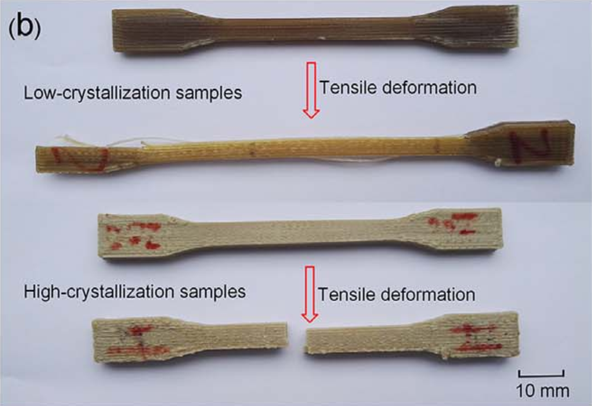 

---

<!--footer: ''-->

## What is Peridynamics?

- Alternative to classical continuum mechanics: $\text{div}(\boldsymbol{\sigma})+\textbf{b} =\rho\ddot{\textbf{u}}$
- PD integral equation:
  $\int_{\mathcal{H}}(\underline{\textbf{T}}(\textbf{x},t)- \underline{\textbf{T}}(\textbf{x}',t))dV_{\textbf{x}}+\textbf{b} =\rho\ddot{\textbf{u}}$
- Focus material modeling and crack propagation; no $C^1$ continuity for the displacement

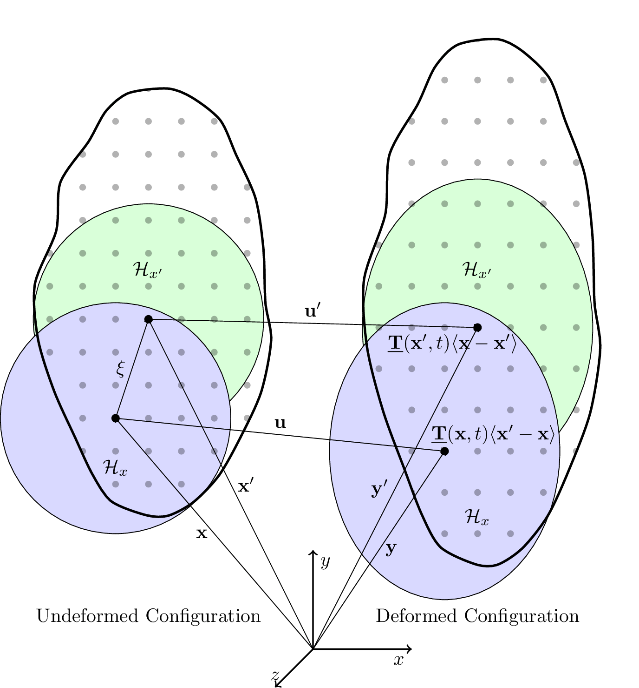

---

## PD Solving the integral - Material point method

__Advantages__  
- Fast to implement
- Failure propagation
- Discretization

__Disadvantages__  
- Convergence is lower
- Surfaces are not known

---

# Peridynamics correspondence formulation

---
# Derivation

force density stress states

$$
\underline{\mathbf{T}}_{ij} = \underline{\omega}_{ij}\,\mathbf{P}_i\,\mathbf{D}_i^{-1}\,\underline{\mathbf{X}}_{ij}
$$

with First Piola-Kirchhoff-stresses

$$
\mathbf{P}_i = \det(\mathbf{F}_i)\,\boldsymbol{\sigma}_i\,\mathbf{F}_i^{-T}
$$

forces at each point
$$
\mathbf{F}_i^{\text{pd}} = \sum_{j \in \mathcal{H}_i}\left(\underline{\mathbf{T}}_{ij} V_j - \underline{\mathbf{T}}_{ji} V_i\right)
$$

---

deformation gradient in discrete form

$$
\mathbf{F}_i = \mathbf{I} + \left[ \sum_{k \in \mathcal{H}_i} \underline{\omega}_{ik}\, V_k\, \underline{\mathbf{U}}_{ik} \otimes \underline{\mathbf{X}}_{ik} \right] \mathbf{D}_i^{-1}
$$

with shape tensor as

$$
\mathbf{D}_i = \sum_{j \in \mathcal{H}_i} \underline{\omega}_{ij}\, V_j\, \underline{\mathbf{X}}_{ij} \otimes \underline{\mathbf{X}}_{ij}
$$

and linearized strain

$$
\boldsymbol{\varepsilon}_i = \frac{1}{2}(\mathbf{F}_i + \mathbf{F}_i^T) - \mathbf{I}
$$

---

# Stiffness matrix assembly

$$
K_{ij}^{\text{fwd}} = -\underline{\omega}_{ij}^2 V_j^2\, \underline{\mathbf{X}}_{ij}^T \mathbf{D}_i^{-1} [\mathbf{C}_i : \mathbf{B}_{ij}]
$$

$$
K_{ik}^{\text{fwd}} = -\underline{\omega}_{ij}V_j\, \underline{\omega}_{ik}V_k\, \underline{\mathbf{X}}_{ij}^T \mathbf{D}_i^{-1} [\mathbf{C}_i : \mathbf{B}_{ik}] \quad (k \neq j)
$$

$$
K_{ii}^{\text{fwd}} = \sum_{k \in \mathcal{H}_i} \underline{\omega}_{ij}V_j\, \underline{\omega}_{ik}V_k\, \underline{\mathbf{X}}_{ij}^T \mathbf{D}_i^{-1} [\mathbf{C}_i : \mathbf{B}_{ik}]
$$

$$
K_{ii}^{\text{bwd}} = -\sum_{j: i \in \mathcal{H}_j} \underline{\omega}_{ji}^2 V_i^2\, \underline{\mathbf{X}}_{ji}^T \mathbf{D}_j^{-1} [\mathbf{C}_j : \mathbf{B}_{ji}]
$$

$$
K_{ik}^{\text{bwd}} = -\sum_{\substack{j: i \in \mathcal{H}_j \\ k \in \mathcal{H}_j}} \underline{\omega}_{ji}V_i\, \underline{\omega}_{jk}V_k\, \underline{\mathbf{X}}_{ji}^T \mathbf{D}_j^{-1} [\mathbf{C}_j : \mathbf{B}_{jk}]
$$

---

# Zero energy mode compensation

$$
\mathbf{K}_{\text{total}} = \mathbf{K}_{\text{correspondence}} + \mathbf{K}_{\text{stabilization}}
$$

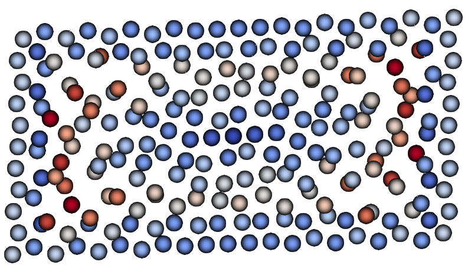
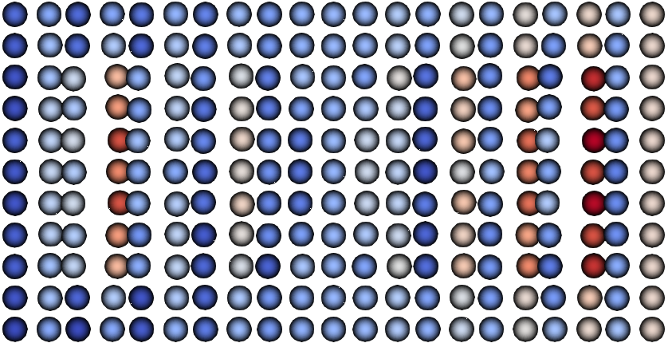
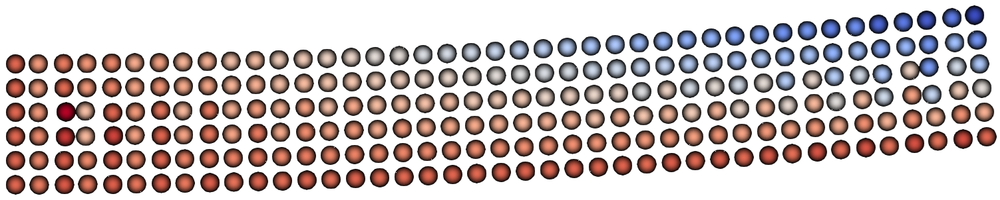

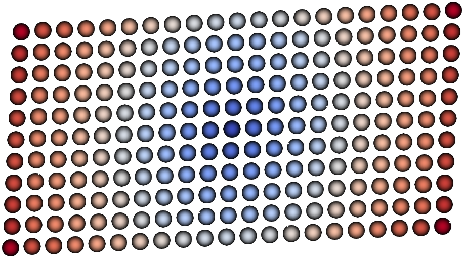
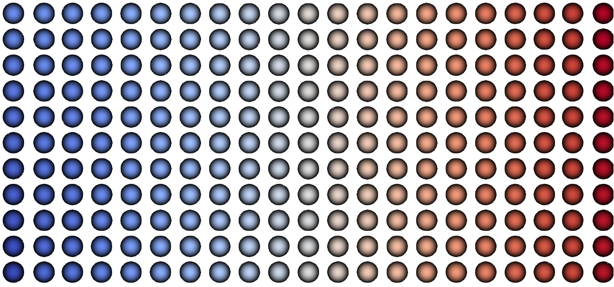
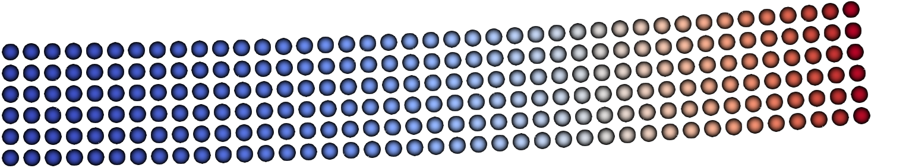

---

# Including thermal effects

- Convection
- Heat transfer
- Thermo-mechanical coupling

---

## Thermo-mechanics

$$
\boldsymbol{\varepsilon} = \boldsymbol{\varepsilon}_{\text{mechanical}} + \boldsymbol{\varepsilon}_{\text{thermal}}
$$

$$
\boldsymbol{\varepsilon}_{\text{thermal}} = -\boldsymbol{\alpha}\tau
$$

computing thermal stresses to determine the internal forces
$$
\boldsymbol{\sigma}_{thermal} = -\mathbf{C}\cdot\cdot\left(\boldsymbol{\alpha}\tau \right)
$$

## Thermal flux (PD) [5]

$$
\rho C_v\dot{\tau} = \int_{\mathcal{H}}\left(\underline{h}(\mathbf{x},t)\langle\boldsymbol{\xi}\rangle - \underline{h}(\mathbf{x}',t)\langle\boldsymbol{\xi}'\rangle\right)dV_{\mathbf{x}} + S_i
$$

<!--footer: 'M.A. Zeleke & M. B. Ageze (2021). A Review of Peridynamics (PD) Theory of Diffusion Based Problems'-->

---

<!--footer: ''-->

## Single Bond

$$
\underline{h}(\mathbf{x},t)\langle\boldsymbol{\xi}\rangle = \mathbf{q}^T\mathbf{D}^{-1}(\mathbf{x})\boldsymbol{\xi}
$$

$$
\nabla\cdot\mathbf{q} = \int_{\mathcal{H}}\left[\mathbf{q}(\mathbf{x}')^T\mathbf{D}^{-1}(\mathbf{x}') + \mathbf{q}(\mathbf{x})^T\mathbf{D}^{-1}(\mathbf{x})\right]\boldsymbol{\xi}\,dV_{\mathbf{x}}
$$

$$
\mathbf{q} = -\boldsymbol{\lambda}\nabla\tau
$$

$$
\nabla\tau = \mathbf{D}^{-1}\int_{\mathcal{H}}\left[\tau(\mathbf{x}')-\tau(\mathbf{x})\right]\boldsymbol{\xi}\,\underline{\omega}\langle\boldsymbol{\xi}\rangle\, dV_{\mathbf{x}}
$$

---

## Time integration

$$
\rho C_v \frac{\tau^{t+dt}-\tau^{t}}{dt} = \nabla\cdot\mathbf{q} + S_i
$$

$$
\tau^{t+dt} = dt\,\frac{\nabla\cdot\mathbf{q} + S_i}{\rho C_v} + \tau^{t}
$$

$$
S_i = \frac{q_{bc}}{\Delta}, \qquad q_{bc} = \kappa(\tau - \tau_{env})
$$

---

## Determine the surface (2D / 3D)

$$
V_{2D} = 2\pi\delta^2 h \geq \int_{\mathcal{H}}dV
$$

$$
V_{3D} = \frac{4}{3}\pi\delta^3 \geq \int_{\mathcal{H}}dV
$$

$$
f_{limit} \leq V_{\text{specific}} = \frac{\int_{\mathcal{H}}dV}{V_{2D\,\text{or}\,3D}}
$$

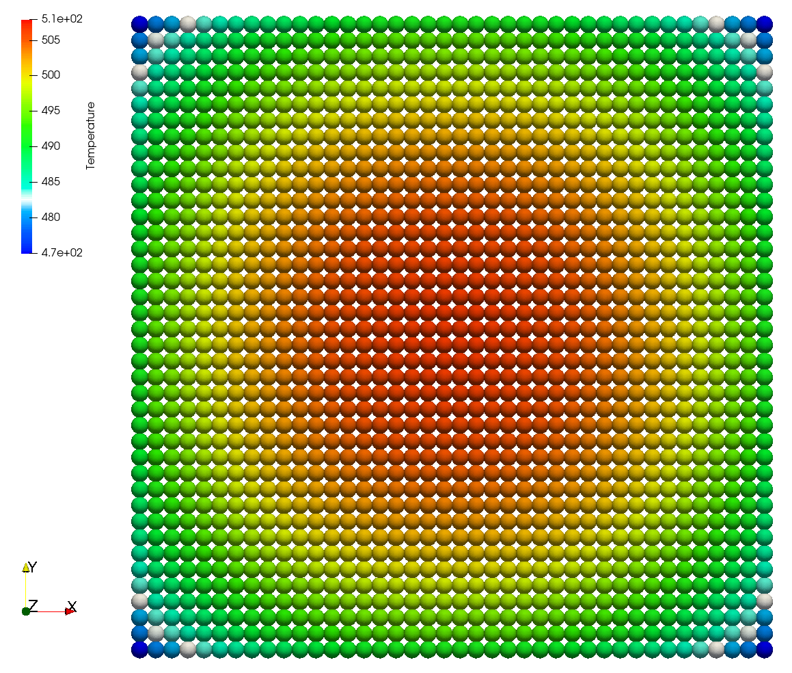

<!--footer: 'Figure Source: Willberg et al., Peridynamic Framework to Model Add ...'-->

---
<!--footer: ''-->

## Stable time step

$$
\Delta t < \min\left(\frac{(\rho C_v)_i}{\displaystyle\sum_{j=1}^{N}\frac{\max(\text{eig}(\boldsymbol{\lambda}))}{|\boldsymbol{\xi}_{ij}|}V_j}\right)
$$

- thermal time step multiple orders above the mechanical one

---

# Subroutine 

-  Calculation of crystallization, dual kinetic model (by Velisaris & Seferis)

- Implementation in Fortran HETVAL Subroutine for usage in Abaqus
  - Calculates crystallization kinetics through process simulation
  - Degree of crystallization at every time step 

- Temperature and time from the process simulation are inputs for the subroutine  

- Stiffness value $E$ of each node will be adapted based on the degree of crystallization

- Fitting function: $X_{VC} =X_{VC\infty}(w_1F_{\theta1}(k)+w_2F_{\theta2}(k))$

---

# Analysis comparison
## Fully Dynamic Static Mechanical and Thermal 3D Printing

**Fully dynamic simulation**
- 10 hours total runtime
-  Time increment: $8.96 \times 10^{-8}$ s
-  $\approx 364\,\mu\text{s}$ per step (average)

**Quasi-static**
- 2 seconds total simulation time
- 1 second per increment
- 90.8 ms per step (average)

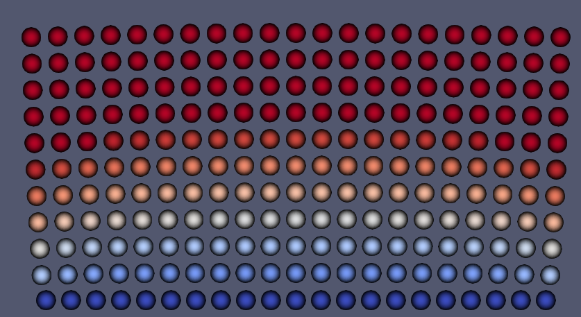

---

# Peridynamic Framework (PeriLab [4])

- No pre-processing required, mesh will be generated based on the gcode
- Material Models:
  - PD Solid Elastic
- Thermal Models:
  - Thermal Flow
  - Heat Transfer
  - HETVAL subroutine
- Damage Models:
  - Critical Stretch

---

<!--footer: 'Specimen Geometry: ASTM D638'-->

# Dogbone Specimen

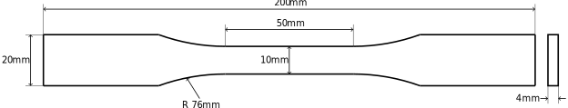

- Three step simulation process:
  - Printing specimen
  - Cooling step
  - Tensile test
- Layer height = 0.2mm  (20 Layers)

---

<!--footer: ''
_class: cols-2-1-->

# Simulation Properties

## Material: PEEK (Polyetheretherketon)

| Parameter     | Value        |
| ------------- | -------------|
| $E$           | $3800\ MPa$  |
| $\nu$         | $0.33$       |
| $\rho$        | $1240\times 10^{-12} \frac{t}{mm^3}$|
|$s_c$          | $0.12$        |   

## Thermal Properties

| Parameter | Value     |
| --------- | --------- |
| $\kappa$  | $0.12$ |
| $h$       | $15.0\times 10^{-3} \frac{t}{s^3K}$ |
| $T_P$     | $653.15K$ |
| $T_{RT}$  | $293.15K$ |
| $c$       | $1800.0\times 10^{6} \frac{mm^2}{s^2K}$ |

$T_E = [473.15K; 423.15K; 373.15K; 293.15K]$

---

<!-- _class: section-slide-rocket -->

## Simulation Results

---

# Simulation Results
 
<iframe width="1150" height="500" src="https://www.youtube.com/embed/dGfJG9AoL4g?si=22l_pryTfsmBexXY" title="YouTube video player" frameborder="0" allow="accelerometer; autoplay; clipboard-write; encrypted-media; gyroscope; picture-in-picture; web-share" referrerpolicy="strict-origin-when-cross-origin" allowfullscreen></iframe>

---

## Simulation Results

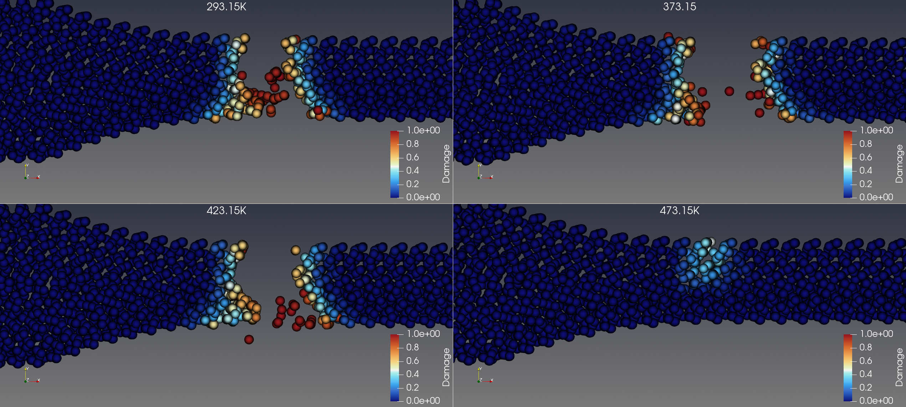

- Crack initiation and propagation similar, only initiation time slightly differs

---

<!--footer: ''-->

# Load-Displacement

<iframe src="assets/plot.html" width="95%" height="95%" style="border: 0; margin-left: 70px"></iframe>

---

# Discussion and further work

- Basic influence of different process parameters can be captured
- PeriLab allows efficient and statistical analysis of the AM process

- Verification with experiments
- Variation of diverse process parameters
- Influence of printbed

---

<!--header: ''-->

# Thank you!

[Christian Willberg](mailto:christian.willberg@h2.de) (h2)
[Jan-Timo Hesse](mailto:jan-timo.hesse@dlr.de) (DLR)

---

# References

1. [J. Shah, B. Snider, T. Clarke, S. Kozutsky, M. Lacki & A. Hosseini (2019). Large-scale 3D printers for additive manufacturing: design considerations and challenges.](https://doi.org/10.1007/s00170-019-04074-6 )
2. [C. Yang, X. Tian, D. Li, Y. Cao, F. Zhao & C. Shi (2017). Influence of thermal processing conditions in 3D printing on the crystallinity and mechanical properties of PEEK material.](https://doi.org/10.1016/j.jmatprotec.2017.04.027)
4. [C. Willberg, J.-T. Hesse, R. Hein & F. Winkelmann (2024). Peridynamic Framework to Model Additive Manufacturing Processes.](https://doi.org/10.1002/adts.202400818)
4. [C. Willberg, J.-T. Hesse & A. Pernatii (2024). PeriLab - Peridynamic Laboratory.](https://doi.org/10.1016/j.softx.2024.101700)

5. [M.A. Zeleke & M. B. Ageze (2021). A Review of Peridynamics (PD) Theory of Diffusion Based Problems.](https://onlinelibrary.wiley.com/doi/10.1155/2021/7782326)

---

## Funding

| Name                                                                                                         | Logo                                                                                                                 | Grant number                                                  |
| ------------------------------------------------------------------------------------------------------------ | -------------------------------------------------------------------------------------------------------------------- | ------------------------------------------------------------- |
| [German Research Foundation](https://www.dfg.de/)                                                            |      | [WI 4835/5-1](https://gepris.dfg.de/gepris/projekt/456427423) |
| [Saxon State Parliament](https://www.landtag.sachsen.de/de)                                                  |  | [3028223](https://www.m-era.net/materipedia/2020/emma)        |
| [Federal Ministry for Economic Affairs and Climate Action](https://www.bmwk.de/Navigation/DE/Home/home.html) |   | 20W2214G                                                      |
