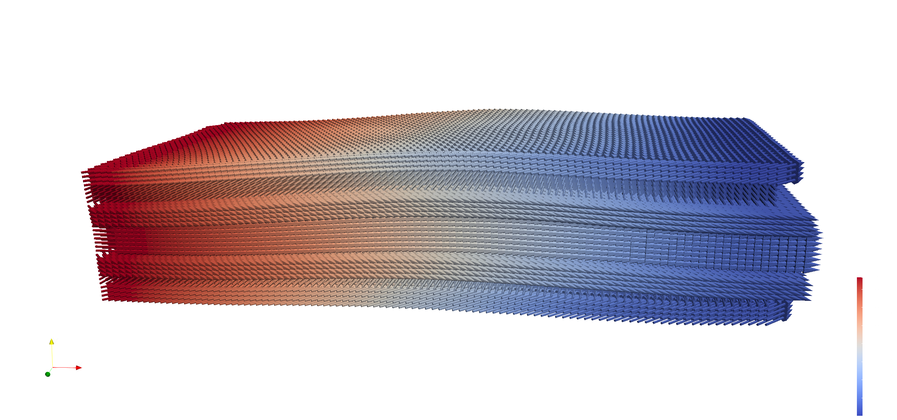
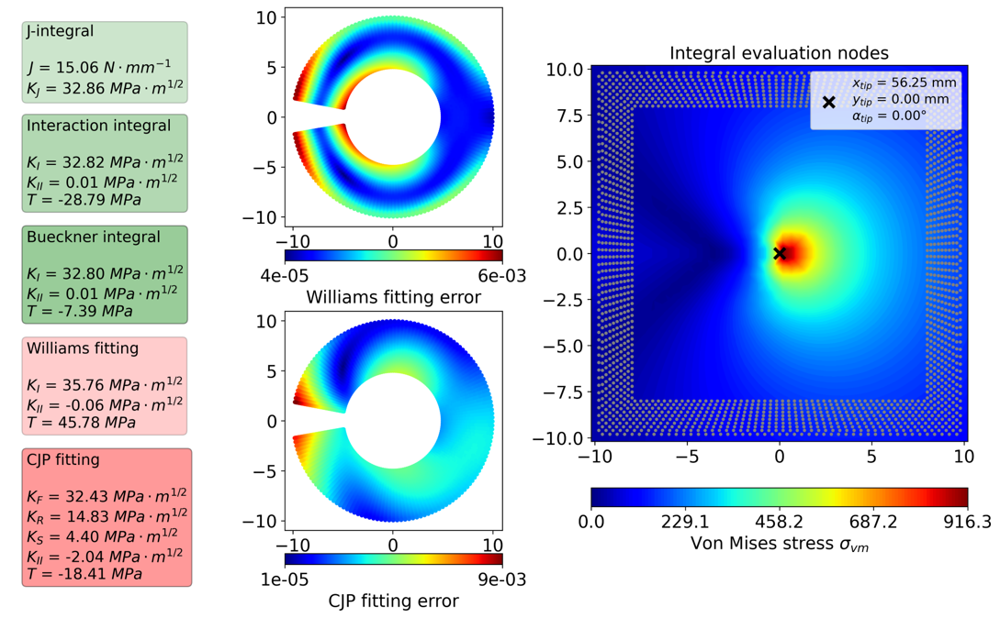

<!-- _class: title-slide -->

## Micromechanical analysis via Peridynamics 

 
    

Jan-Timo Hesse, Christian Willberg
 

> <a href="https://sites.google.com/usacm.org/pd25/home" style="color: black; text-decoration: underline;">PeriHub - Empowering Research with Peridynamic Modeling</a> 
> _October 8th, 2024, Braunschweig_

Presentation URL: https://perihub.github.io/Presentations/MICRO_ANALYSIS

---

<!--paginate: true-->
<!--footer: 'Pres. URL: https://perihub.github.io/Presentations/MICRO_ANALYSIS'-->

## Motivation Peridynamics (PD)

- alternative to classcical continuum mechanics $\text{div}(\mathbf{\sigma})+\textbf{b} =\rho\ddot{\textbf{u}}$
- PD integral equation
  $\int_{\mathcal{H}}(\underline{\textbf{T}}(\textbf{x},t)- \underline{\textbf{T}}(\textbf{x}',t))dV_{\textbf{x}}+\textbf{b} =\rho\ddot{\textbf{u}}$
- focus material modeling and crack propagation no $C^1$ continuity for the displacement

---

## PD Solving the integral - Material point method

__Advantages__  
- fast to implement
- cracks are easy to include
- discretization

__Diadvantages__  
- convergence is lower
- surfaces are not known

---

## PeriHub - Empowering Research with Peridynamic Modeling

- Web Framework for Peridynamic Analysis
- Open Source
- Features
  - Generate 2D or 3D peridynamic meshes
  - Run simulation locally or on clusters
  - Analyse results directly in the browser

---

## Generate model

---
<!--header: ''-->

## RVE

<iframe src="https://perilab-results.nimbus-extern.dlr.de/models/RVE" width="1150" height="600"></iframe>

---

## Composite

---

## Crack Analysis Tool ([CrackPy](https://github.com/dlr-wf/crackpy))

---

# Thank you

[Jan-Timo Hesse](mailto:jan-timo.hesse@dlr.de) (DLR)
[Christian Willberg](christian.willberg@h2.de) (h2)
