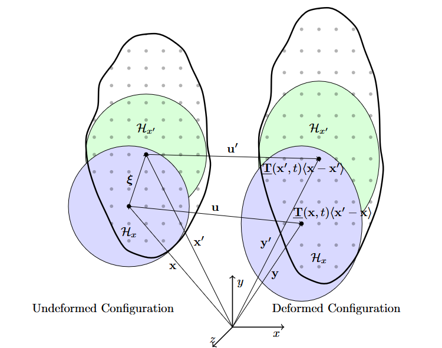
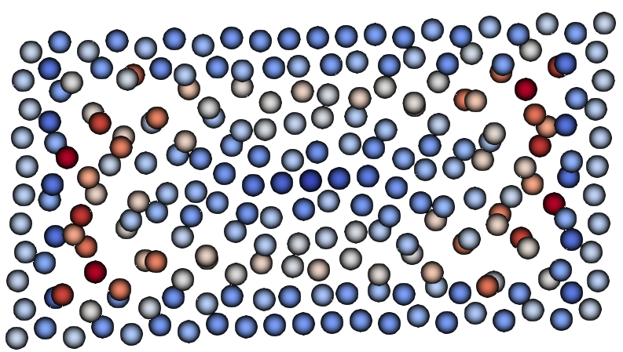
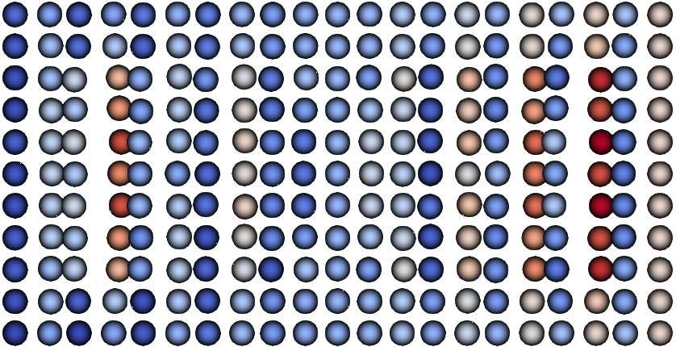
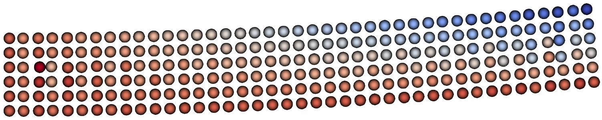
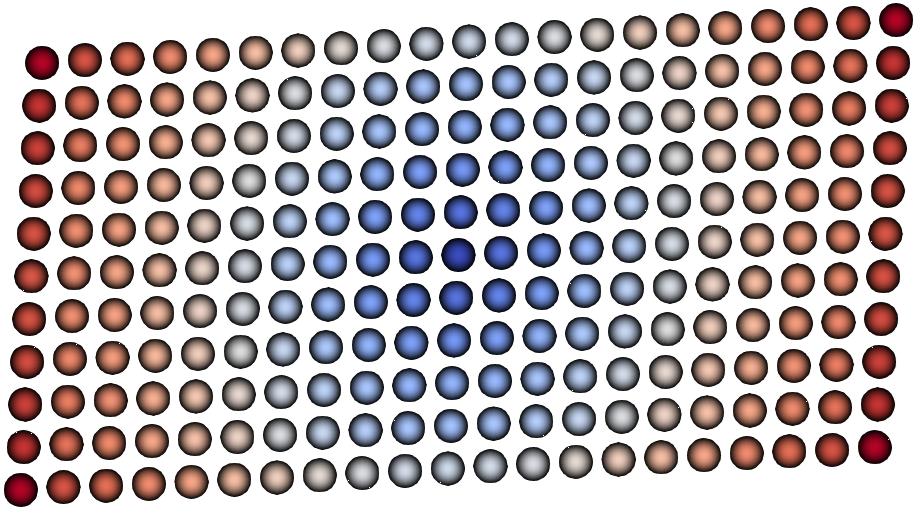
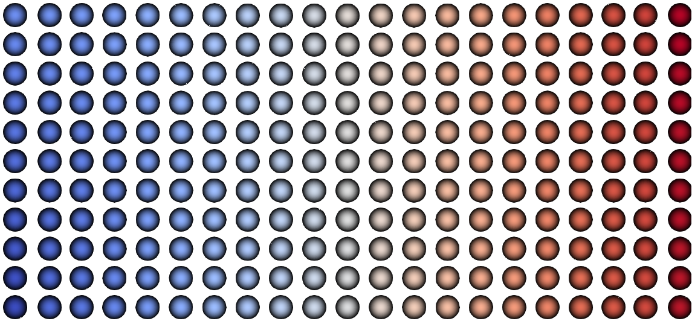
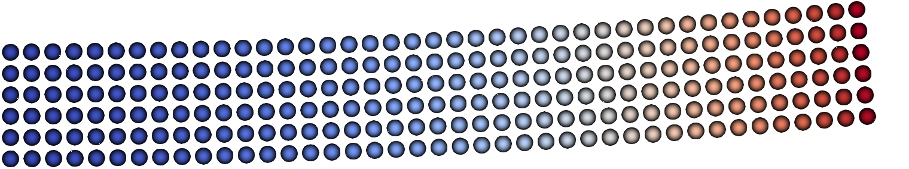
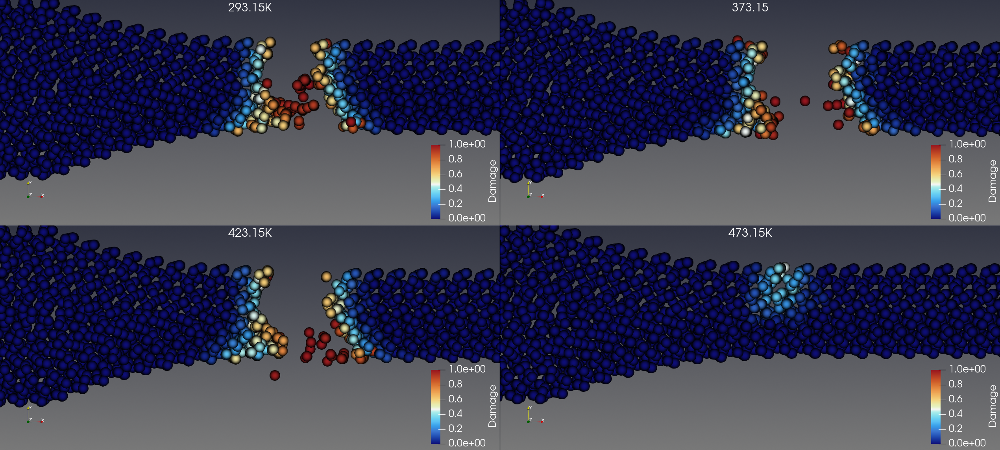
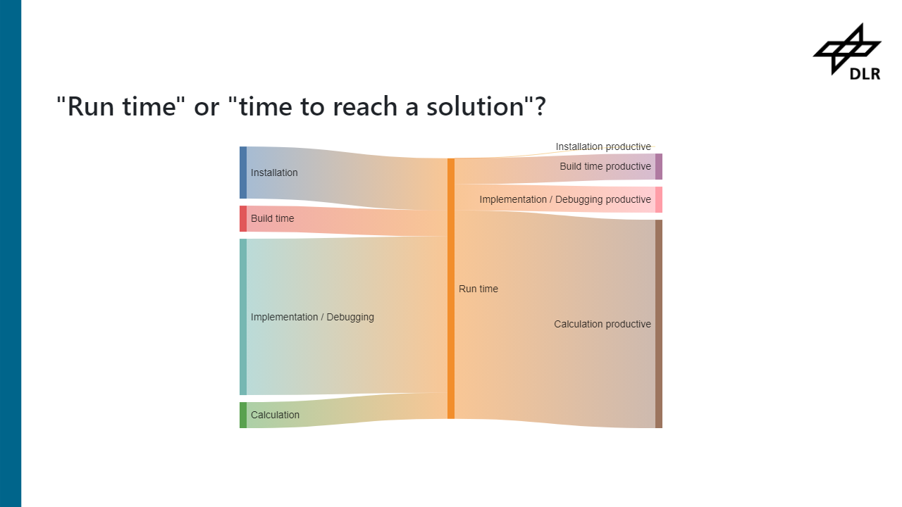

<style>
section {
  font-family: 'Segoe UI', sans-serif;
  font-size: 23px;
  padding: 38px 48px;
  color: #1e2a3a;
}
section h1 {
  font-size: 34px;
  color: #1a5276;
  padding-bottom: 8px;
  margin-bottom: 18px;
}
section h2 {
  font-size: 24px;
  margin-bottom: 12px;
}
section h3 {
  font-size: 20px;
  margin-bottom: 8px;
}
.box {
  background: #fdf2e9;
  border: 2px solid #e67e22;
  border-radius: 8px;
  padding: 14px 20px;
  margin: 10px 0;
}
.box strong { color: #d35400; }
.green {
  background: #eafaf1;
  border-left: 4px solid #27ae60;
  padding: 12px 18px;
  margin: 10px 0;
  border-radius: 0 6px 6px 0;
}
.eq {
  background: #f4ecf7;
  border: 1px solid #c39bd3;
  border-radius: 8px;
  padding: 10px 20px;
  text-align: center;
  margin: 12px 0;
}
.note {
  background: #eaf2f8;
  border-left: 4px solid #2e86c1;
  padding: 10px 16px;
  margin: 8px 0;
  border-radius: 0 6px 6px 0;
  font-size: 20px;
}
.cols {
  display: flex;
  gap: 36px;
}
.cols > div { flex: 1; }
table {
  border-collapse: collapse;
  width: 100%;
  margin: 10px 0;
  font-size: 19px;
}
th {
  background: #1a5276;
  color: white;
  padding: 7px 12px;
  text-align: left;
}
td {
  padding: 6px 12px;
  border-bottom: 1px solid #d5dbdb;
}
tr:nth-child(even) td { background: #f2f3f4; }
ul { padding-left: 20px; margin: 6px 0; }
li { margin-bottom: 4px; }
footer { font-size: 14px; color: #888; text-align: right; }
</style>

<!-- _class: title-slide -->

# Simulation Software in the Age of AI
## Peridynamics · Julia · Sustainable Data

Prof. Dr.-Ing. Christian Willberg[](https://orcid.org/0000-0003-2433-9183)
christian.willberg@h2.de


> **Open Day** — Hotel Albatros, Yaoundé, Cameroon
> _25 April 2026_


<div style="position: absolute; top: 20px; left: 1050px;"> 
    
</div>


<!--paginate: true-->


---

# "Just use AI for that."

<div class="cols">
<div>

### What AI does well
- Pattern recognition in large datasets
- Fast inference once trained
- Image classification, NLP, …
- Interpolation within training distribution

</div>
<div>

### What AI struggles with
- **Data hunger** — needs millions of examples
- **Black box** — no physical explanation
- **Extrapolation** — fails outside training domain
- **Rare events** — cracks, crashes, failures

</div>
</div>

<div class="box">

**The engineering problem:** Structural failures are rare by design. You cannot collect enough real crash or fracture data to train a reliable AI model from experiments alone.

</div>

---

# The Data Scarcity Problem

<div class="cols">
<div>

### In image recognition
- ImageNet: **14 million** labelled images
- Training is cheap, data is abundant

### In structural mechanics
- A single fracture experiment: **days of preparation**, expensive specimen, one data point
- Statistical analysis requires **hundreds** of tests

</div>
<div>

<div class="green">

**Simulation as a data generator**

Physics-based simulations can produce thousands of consistent, labelled, physically meaningful data points — at a fraction of the cost of experiments.

</div>

<div class="note">

This is not anti-AI. This is what makes AI *possible* in engineering.

</div>

</div>
</div>

---

# Simulation and AI — Not Competitors

<div class="cols">
<div>

**Simulation provides:**
- Synthetic training data
- Physical constraints (loss functions)
- Interpretable reference solutions
- Extrapolation beyond observed data

**AI provides:**
- Fast surrogate models
- Parameter identification
- Uncertainty quantification
- Pattern discovery in simulation output

</div>
<div>

<div class="eq">

$$\underbrace{\text{Simulation}}_{\text{physics}} + \underbrace{\text{AI}}_{\text{speed}} = \underbrace{\text{Digital Twin}}_{\text{engineering value}}$$

</div>

<div class="note">

Physics-informed neural networks (PINNs), neural operators, surrogate models — all rely on simulation data or physics constraints.

</div>

</div>
</div>

---

# But: Garbage In, Garbage Out

<div class="cols">
<div>

If simulations generate the training data for AI models, then **the quality, reproducibility, and traceability of simulations** becomes critical.

- Wrong simulation → wrong training data → wrong AI model
- Irreproducible simulation → irreproducible AI result
- Untraceable data → untrustworthy decision

</div>
<div>

<div class="box">

**Three requirements follow:**

1. **Good physics** — the simulation must capture the right phenomena
2. **Sustainable software** — results must be reproducible
3. **Data provenance** — every result must be traceable

</div>

</div>
</div>

<div class="note">

This is the thread of today's talk: physics → software → data.

</div>

---
# Fracture & Fatigue

## Aloha Airlines Flight 243 (1988)


## Eschede Train Disaster (1998)


---

## Fokus here — Crack Propagation

<div class="ldiv">

- Crack **already exists** (from manufacturing, inspection limit, LCF/HCF initiation)
- Governed by **fracture mechanics**
- **Paris Law:**

$$\frac{da}{dN} = C \cdot \Delta K^m$$

where $\Delta K = \Delta\sigma \cdot Y \cdot \sqrt{\pi a}$

- Three regions: threshold → stable growth → unstable fracture

</div>
<div class="rdiv">


**Characteristic:**
- Crack grows cycle by cycle
- Basis of **damage tolerance** design
- Inspection intervals derived from crack growth rate

</div>

---

# Part 2 — Peridynamics

---

# Why a New Simulation Method?

<div class="cols">
<div>

**Classical continuum mechanics**

$$\operatorname{div}(\boldsymbol{\sigma}) + \mathbf{b} = \rho\ddot{\mathbf{u}}$$

- Requires spatial derivatives of $\boldsymbol{\sigma}$
- At cracks: derivatives **undefined**
- Cracks must be prescribed or tracked (XFEM, CZM)
- Mesh distortion → remeshing

</div>
<div>

## FEM
- method to approximate classical continuum mechanics
- cracks lead to infinite stresses, because no valid solution exists

</div>
</div>


---


**Peridynamics (PD)**

$\int_{\mathcal{H}}\!\bigl(\underline{\mathbf{T}}\langle\boldsymbol{\xi}\rangle - \underline{\mathbf{T}}'\langle{-}\boldsymbol{\xi}\rangle\bigr)\,dV' + \mathbf{b} = \rho\ddot{\mathbf{u}}$

- Integral equation — no spatial derivatives
- Valid **across cracks**
- Cracks emerge naturally from material failure
- No remeshing needed



<div class="note">

Silling (2000): "Reformulation of elasticity theory for discontinuities and long-range forces."

</div>

---

# The Peridynamic Horizon

<div class="cols">
<div>

- Each point $\mathbf{x}$ interacts with all neighbours $\mathbf{x}'$ within horizon $\delta$
- **Reference bond:** $\boldsymbol{\xi} = \mathbf{x}' - \mathbf{x}$
- **Relative displacement:** $\boldsymbol{\eta} = \mathbf{u}' - \mathbf{u}$
- Damage: bond breaks, e.g. when stretch exceeds $s_c$

$$s = \frac{|\boldsymbol{\xi}+\boldsymbol{\eta}| - |\boldsymbol{\xi}|}{|\boldsymbol{\xi}|} > s_c$$

</div>
<div>

<div class="note">

**Key insight:** The horizon $\delta$ is a material length parameter. As $\delta \to 0$, peridynamics converges to classical continuum mechanics. No special crack tracking is needed — damage is a natural outcome.

</div>

| Horizon ratio $m = \delta/\Delta x$ | Effect |
|---|---|
| $m = 3$ | Good compromise |
| $m = 4{-}5$ | Better convergence |
| $m \to \infty$ and $\delta \to 0$ | Classical CM |

</div>
</div>

---

# From Bond-based to Correspondence

| Formulation | Key idea | Poisson's ratio | Anisotropy |
|---|---|---|---|
| Bond-based (BB) | Pairwise spring force | $\nu = 1/4$ fixed | No |
| Ordinary state-based (OSB) | Collective, central force | Arbitrary | No |
| Non-ordinary state-based (NOSB) | Deformation gradient $\mathbf{F}$ | Arbitrary | Yes |
| Correspondence (CCM) | $\mathbf{F}$ → classical $\boldsymbol{\sigma}$ | Arbitrary | Yes |

<div class="green">

**Correspondence model:** compute $\mathbf{F}$ from the PD neighbourhood, apply any classical material model to get $\boldsymbol{\sigma}$, convert back to PD force density state. Enables direct reuse of existing constitutive models.

</div>

---

# Correspondence — Core Equations

<div class="cols">
<div>

**Shape tensor** (computed once):
$$\mathbf{K} = \int_{\mathcal{H}} \underline{\omega}\,\underline{\mathbf{X}}\langle\boldsymbol{\xi}\rangle\otimes\underline{\mathbf{X}}\langle\boldsymbol{\xi}\rangle\,dV'$$

**Deformation gradient:**
$$\mathbf{F} = \!\left[\int_{\mathcal{H}} \underline{\omega}\, \langle\boldsymbol{\xi}\rangle\underline{\mathbf{Y}}\langle\boldsymbol{\xi}\rangle\otimes\underline{\mathbf{X}}\langle\boldsymbol{\xi}\rangle\,dV'\right]\mathbf{K}^{-1}$$

**Linearised strain:**
$$\boldsymbol{\varepsilon} = \tfrac{1}{2}(\mathbf{F}+\mathbf{F}^T) - \mathbf{I}$$

</div>
<div>

**Stress** (any classical model):
$$\boldsymbol{\sigma} = \mathbf{C}:\boldsymbol{\varepsilon}$$

**Force density state:**
$$\underline{\mathbf{T}}\langle\boldsymbol{\xi}\rangle = \underline{\omega}\,\boldsymbol{\sigma}\,\mathbf{K}^{-1}\boldsymbol{\xi}$$

**Equation of motion:**
$$\rho\ddot{\mathbf{u}} = \int_{\mathcal{H}}\!\bigl(\underline{\mathbf{T}}\langle\boldsymbol{\xi}\rangle - \underline{\mathbf{T}}'\langle{-}\boldsymbol{\xi}\rangle\bigr)\,dV' + \mathbf{b}$$

</div>
</div>

---

<div style="display: flex; gap: 150px;">
<div style="display: flex; flex-direction: column; gap:8px;">





</div>

<div style="display: flex; flex-direction: column; gap:8px;">





</div>
</div>


---

# Application: Additive Manufacturing

<div class="cols">
<div>

**Challenge:** Material properties in 3D printing are created *during* the process
- Crystallisation (PEEK)
- Thermal gradients → residual stress
- Layer-by-layer activation

**PD approach:**
- Progressive node activation follows G-code
- Thermo-mechanical coupling
- Crystallisation kinetics via HETVAL subroutine
- $E$ adapted per node based on degree of crystallisation

</div>
<div>

<div class="note">

**Why PD for AM?**
Residual stresses cause delamination and cracking — exactly the discontinuous phenomena where PD is strongest. No remeshing as layers are added.

</div>

**Simulation workflow:**
1. Print specimen (layer activation)
2. Cooling step (thermal field)
3. Tensile test (fracture)

</div>
</div>


---

# Simulation Results
<br/>
<iframe width="1150" height="500" src="https://www.youtube.com/embed/dGfJG9AoL4g?si=22l_pryTfsmBexXY" title="YouTube video player" frameborder="0" allow="accelerometer; autoplay; clipboard-write; encrypted-media; gyroscope; picture-in-picture; web-share" referrerpolicy="strict-origin-when-cross-origin" allowfullscreen></iframe>

---

## Simulation Results



- Crack initiation and propagation similar, only initiation time slightly differs


---

# Part 3 — Sustainable Software

---

# The Reproducibility Crisis in Simulation

<div class="cols">
<div>

**Common scenario:**
- Paper published with impressive results
- Code not released, or released without documentation
- Dependencies change → code no longer compiles
- Result cannot be reproduced 2 years later

**This matters for AI:**
- If simulation data cannot be reproduced → training data is untrustworthy
- Published benchmarks become irreproducible

</div>
<div>

<div class="box">

**A concrete example: Peridigm**

Dependencies: CMake, MPI, Python, Fortran, C, C++, Trilinos (Blas, Lapack, X11), Boost, HDF5, NetCDF-C

Installation time: **1 day to 1 week** — *if* it works.

A solution that does not run requires infinite time to solve a problem.

</div>

</div>
</div>

---

# What Makes Software Sustainable?

<div class="cols">
<div>

**Technical criteria**
- Reproducible builds (package manager)
- Version control (Git)
- Automated testing (CI/CD)
- Clear dependency management
- Documentation

</div>
<div>

**Community criteria**
- Open source licence
- Modular architecture (easy to extend)
- Low entry barrier
- Long-term maintenance plan
- FAIR principles for code

</div>
</div>

<div class="green">

**FAIR for software:** Findable · Accessible · Interoperable · Reusable — the same principles applied to research data now increasingly applied to research software.

</div>

---

# Why Julia?

<div class="cols">
<div>

**The two-language problem:**
- Prototype in Python (easy, slow)
- Rewrite in C++ for performance (hard, fast)
- Two codebases, two maintenance efforts

**Julia solves this:**
- Python-like syntax, C-like speed
- JIT compilation
- Native package manager (Pkg)
- First-class parallelism (MPI, threads)
- Easy to learn for PhD students

</div>
<div>

<div class="eq">

**Performance comparison**
(2×2 matrix inversion, inner loop)

| Method | Time |
|---|---|
| `inv(Matrix)` Julia | ~302 ns |
| `StaticArrays` Julia | ~2 ns |
| Equivalent C++ | ~2 ns |

</div>

<div class="note">

Julia achieves C-level performance with Python-level readability — without sacrificing either.

</div>

</div>
</div>

---





---

# PeriLab — Design Philosophy

<div class="cols">
<div>

**Goal:** Reduce the entry barrier to peridynamic simulation

**Key decisions:**
- Julia as implementation language
- Package manager for all dependencies
- Macro-based module loading (no recompilation for new models)
- New material model: **1 file** (vs. 5+ in Peridigm)
- New input parameter: **in YAML** (vs. 6 files + recompile)
- MPI parallelism built in

</div>
<div>

| Criterion | Peridigm | PeriLab |
|---|---|---|
| Installation | Manual | Package manager |
| Build time | ~10 min | < 5 min |
| New material | 5+ files | 1 file |
| New parameter | 6 files + compile | YAML only |
| Libraries | Manual update | Automatic |
| Compilation knowledge | Deep | None |

</div>
</div>

---

# Adding a New Material Model in PeriLab

```julia
# One file, one module — no recompilation of the core
module MyPlasticModel

using PeriLab

function compute_stress(strain, history, params)
    # your constitutive law here
    σ = params["E"] .* strain
    return σ, history
end

end
```

```yaml
# Reference in the YAML input deck — that is all
Material Models:
  MyMaterial:
    Material Model: MyPlasticModel
    E: 210000
```

<div class="note">

The macro system discovers and integrates the module at runtime. No changes to the core codebase, no recompilation, no deep knowledge of the solver internals required.

</div>

---

# PeriHub — Making Simulation Accessible

<div class="cols">
<div>

**PeriHub** is a web-based front end for PeriLab

- Browser-based model setup
- No local installation required
- Results visualised interactively
- Models shared via URL

**Target users:**
- Students exploring PD for the first time
- Researchers running parameter studies
- Industry partners without HPC expertise

</div>
<div>

<div class="green">

**Access:**
[perilab-results.nimbus-extern.dlr.de](https://perilab-results.nimbus-extern.dlr.de)

Examples available:
- DCB fracture
- Dogbone tensile test
- Additive manufacturing

</div>

</div>
</div>

---

# Examples - RVE

<br/>
<iframe width="1150" height="500" src="https://www.youtube.com/embed/ClV2ojQPrFM?si=eROuZGPdBpXTnmef" title="YouTube video player" frameborder="0" allow="accelerometer; autoplay; clipboard-write; encrypted-media; gyroscope; picture-in-picture; web-share" referrerpolicy="strict-origin-when-cross-origin" allowfullscreen></iframe>

---
# Examples - Impact
<br/>
<iframe width="1150" height="500" src="https://www.youtube.com/embed/qj7xGgmjEdE?si=wTN42HPnBmSPxwJ4" title="YouTube video player" frameborder="0" allow="accelerometer; autoplay; clipboard-write; encrypted-media; gyroscope; picture-in-picture; web-share" referrerpolicy="strict-origin-when-cross-origin" allowfullscreen></iframe>

---


# Part 4 — Data Provenance

---

# What Is Data Provenance?

<div class="cols">
<div>

**Provenance** = the complete history of how a result was produced

- Which software version was used?
- Which input parameters?
- Which mesh, which material model?
- Who ran it, when, on which hardware?
- Which pre- and post-processing steps?

</div>
<div>

<div class="box">

**Why it matters:**

If a simulation result is used to train an AI model, and later found to be wrong — can you trace back *which* training data to discard?

Without provenance: **no**.

</div>

</div>
</div>

<div class="note">

Provenance is not just good practice — in regulated industries (aerospace, medical devices) it is a legal requirement. In research, it is the foundation of reproducibility.

</div>

---

# FAIR Data Principles

| Principle | Meaning | In practice |
|---|---|---|
| **F**indable | Persistent identifier | DOI for every dataset |
| **A**ccessible | Open access protocol | Zenodo, DaRUS, … |
| **I**nteroperable | Standard formats | HDF5, JSON, CSV |
| **R**eusable | Licence + provenance | CC-BY + metadata |

<div class="cols">
<div>

**For simulation data this means:**
- Input files versioned alongside results
- Software version recorded (Git hash)
- Environment captured (container / environment file)
- Output linked to input via metadata

</div>
<div>

<div class="note">

A Zenodo record with DOI costs nothing and lasts forever. A GitHub repository without a release tag disappears when the project ends.

</div>

</div>
</div>

---

# Provenance in PeriLab

<div class="cols">
<div>

**What PeriLab records automatically:**
- Software version (Julia + PeriLab package version)
- Input YAML (complete, as run)
- Git hash of the codebase
- Timestamp and compute environment
- Output linked to input by unique run ID

**What PeriHub adds:**
- Web-accessible results with permanent URL
- Model sharing between collaborators
- Version history of model configurations

</div>
<div>

<div class="green">

**The chain:**

```
G-code / geometry
      ↓
PeriLab input (YAML, versioned)
      ↓
Simulation run (version + hash recorded)
      ↓
Output (HDF5 + metadata)
      ↓
PeriHub (interactive, shareable)
      ↓
Zenodo / repository (DOI, FAIR)
      ↓
AI training dataset (traceable)
```

</div>

</div>
</div>

---

# Why This Matters for the Next Generation

<div class="cols">
<div>

**The current situation:**
- Many simulation codes are written once, never maintained
- Results in papers often cannot be reproduced
- Data is stored on personal laptops and lost when people leave
- AI models trained on this data inherit the problems

**What we can do differently:**
- Open source from day one
- Package manager, not manual installation
- FAIR data deposit for every publication
- Provenance as a default, not an afterthought

</div>
<div>

<div class="box">

**You — as the next generation of engineers and researchers — will decide:**

Will the simulation data generated in the next 10 years be usable by the AI models of 2040?

Only if it is stored correctly today.

</div>

</div>
</div>

---

# Conclusion

<div class="cols">
<div>

**Peridynamics**
- Integral formulation — valid across cracks
- Natural fracture without remeshing
- Correspondence model: reuse classical material laws
- Applications: AM, composites, metals

**Sustainable Software**
- Julia: performance + accessibility
- PeriLab: modular, low entry barrier
- PeriHub: browser-based access
- Open source + package management

</div>
<div>

**Data Provenance**
- FAIR principles for simulation data
- Every result traceable to its inputs
- Foundation for trustworthy AI training data
- Zenodo / repositories with DOI

<div class="green">

**The message:**

Simulation and AI are not in competition. Good simulation software with traceable data is what makes AI in engineering *reliable*.

</div>

</div>
</div>

---

# Thank You

**Prof. Dr.-Ing. Christian Willberg**
Magdeburg-Stendal University of Applied Sciences
christian.willberg@h2.de


**Resources:**
- PeriLab: [github.com/PeriHub/PeriLab.jl](https://github.com/PeriHub/PeriLab.jl)
- PeriHub: [perilab-results.nimbus-extern.dlr.de](https://perilab-results.nimbus-extern.dlr.de)
- Presentations: [perihub.github.io/Presentations](https://perihub.github.io/Presentations)

---

# References

1. Silling, S.A. (2000). Reformulation of elasticity theory for discontinuities and long-range forces. *J. Mech. Phys. Solids*, 48(1), 175–209.
2. Willberg, C., Hesse, J.-T., Hein, R. & Winkelmann, F. (2024). Peridynamic Framework to Model Additive Manufacturing Processes. *Adv. Theory Simul.* [doi:10.1002/adts.202400818](https://doi.org/10.1002/adts.202400818)
3. Willberg, C., Hesse, J.-T. & Pernatii, A. (2024). PeriLab – Peridynamic Laboratory. *SoftwareX*. [doi:10.1016/j.softx.2024.101700](https://doi.org/10.1016/j.softx.2024.101700)
4. Wilkinson, M.D. et al. (2016). The FAIR Guiding Principles for scientific data management. *Sci. Data*, 3, 160018.

---

# Showcase