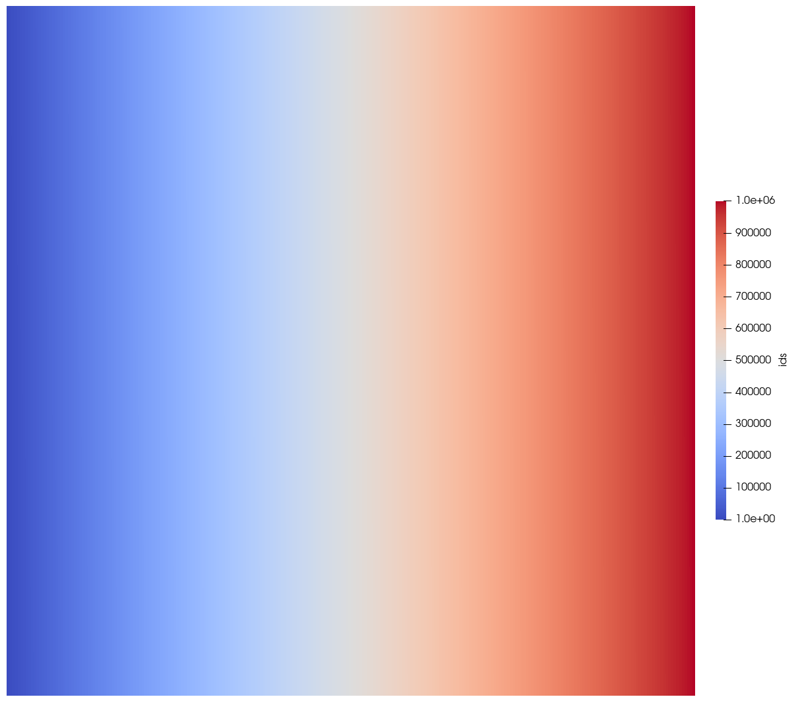
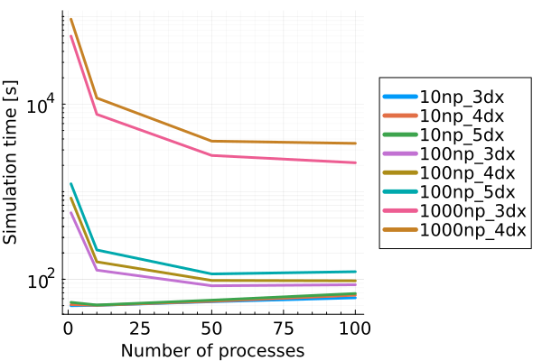

<script type="module">
  import mermaid from 'https://cdn.jsdelivr.net/npm/mermaid@10/dist/mermaid.esm.min.mjs';
  mermaid.initialize({ startOnLoad: true });
</script>

<!-- _class: title-slide -->

# Introduction to PeriLab 

<div style="position: absolute; top: 150px; left: 1050px;"> 
    
</div>

Christian Willberg<a href="https://orcid.org/0000-0003-2433-9183"></a>, Jan-Timo Hesse<a href="https://orcid.org/0000-0002-3006-1520"></a>

2nd Peridynamics Day, August 20th, 2024, Braunschweig

<div style="position: absolute; bottom: 10px; left: 100px; color: grray; font-size: 20px;">
Presentation URL: https://perihub.github.io/Presentations/PDDAY_2024
</div>

<!---
- not the typical computational engineering presentation
- algorithms are impresive, but we asked ourself, why so few algorithms reach the productive phase
-  are our results in paper realy reproducible?
- We discuss all the time about fast algorithms and run time but -> next slide
-->

---

<!--paginate: true-->
<!--footer: 'Pres. URL: https://perihub.github.io/Presentations/PDDAY_2024'-->

## Motivation Peridynamics (PD)

- alternative to classcical continuum mechanics $\text{div}(\mathbf{\sigma})+\textbf{b} =\rho\ddot{\textbf{u}}$
- PD integral equation
  $\int_{\mathcal{H}}(\underline{\textbf{T}}(\textbf{x},t)- \underline{\textbf{T}}(\textbf{x}',t))dV_{\textbf{x}}+\textbf{b} =\rho\ddot{\textbf{u}}$
- focus material modeling and crack propagation no $C^1$ continuity for the displacement


---

## 
- Bond based
- Ordinary state-based
- Correspondence
- Bond associated correspondence

---

## 
- Bond based
- Ordinary state-based
- **Correspondence**
- Bond associated correspondence

---

## Correspondence

$$\mathbf{F}=\left[\int\limits_{\mathcal{H}}\underline{\omega}\langle 
\boldsymbol{\xi}\rangle\underline{\mathbf{Y}}\langle 
\boldsymbol{\xi}\rangle\otimes\underline{\mathbf{X}}\langle 
\boldsymbol{\xi}\rangle dV_{\textbf{x}}\boldsymbol{\xi}\right]\cdot \mathbf{K}^{-1}$$


$$\mathbf{K}=\int\limits_{\mathcal{H}}\underline{\omega}\langle 
\boldsymbol{\xi}\rangle\underline{\mathbf{X}}\langle 
\boldsymbol{\xi}\rangle\otimes\underline{\mathbf{X}}\langle 
\boldsymbol{\xi}\rangle dV_{\textbf{x}}$$ 

$$\underline{\mathbf{T}}\langle \boldsymbol{\xi}\rangle = 
\underline{\omega}\langle 
\boldsymbol{\xi}\rangle\mathbf{P}\mathbf {K}^{ -1 } \boldsymbol { \xi }\quad\text{with}\quad\mathbf{P}=\text{det}\mathbf{F}\boldsymbol{\sigma}\mathbf{F}^{
-1}$$

---


## CM Solving the PDE

- CM is typically solved using finite element method (FEM)
  - state of the art technology; many options
  - flexible
  - not able to model cracks in a consistent way


---

## PD Solving the integral - Material point method

__Advantages__  
- fast to implement
- cracks are easy to include
- discretization

__Diadvantages__  
- convergence is lower
- surfaces are not known


---

## 


---

## PD Software

<div style="display: flex; justify-content: space-between;">

<div style="flex: 1; margin-right: 0px;">

##

  <div class="mermaid">
  %%{init: { 'theme':'forest','quadrantChart': { 'pointLabelFontSize': '130%'} } }%%
  quadrantChart
      x-axis Low Functionalty --> High Functionalty
      y-axis Hard to use --> Simple to use
      Peridigm: [0.85, 0.2]
      PeriLab: [0.5, 0.8]
      EMU: [0.95, 0.1]
      PeriPy: [0.2, 0.7]
      PeriPyDIC: [0.2, 0.6]
      LAMMPS: [0.3, 0.3]
      PeriFlakes: [0.35, 0.4]
      Relation-Based Software: [0.4, 0.25]
      BB_PD: [0.2, 0.50]
      PeriDEM: [0.13, 0.3]
    </div>

</div>

<div style="flex: 1; margin-right: -300px;">

## Reference

[Peridigm](https://link.springer.com/article/10.1007/s42102-023-00100-0)
[PeriLab](https://gitlab.com/dlr-perihub/PeriLab.jl)
[EMU](https://www.osti.gov/biblio/1351608)
[PeriPy](https://doi.org/10.1016/j.cma.2021.114085)
[PeriPyDIC](https://link.springer.com/article/10.1007/s11043-017-9342-3)
[LAMMPS](https://www.osti.gov/biblio/959309/)
[PeriFlakes](https://doi.org/10.1016/j.cma.2017.04.016)
[Relation-Based Software](https://doi.org/10.1016/j.advengsoft.2022.103124)
[BB_PD](https://doi.org/10.1016/j.compstruc.2021.106682)
[PeriDEM](https://doi.org/10.1016/j.jmps.2021.104376)

  </div>

</div>

---

## Problem description - Peridigm

- many publications / algorithms, but not many codes
- Peridigm pain
- solution which does not run "requires" infinite time to solve a problem

<div class="mermaid">
	%%{init: { 'theme':'forest', 'sequence': {'mirrorActors':false} } }%%
	flowchart TD
		Peridigm --- Basics 
		Basics --- CMAke
		Basics --- MPI
		Basics --- Python
		Basics --- Compiler
		Compiler --- Fortran
		Compiler --- C
		Compiler --- C++
		Peridigm --- Libraries
		Libraries --- Trilinos
		Trilinos --- Blas
		Trilinos --- Lapack
		Trilinos --- X11
		Libraries --- Boost
		Libraries --- HDF5
		Libraries --- NetCDF-C
</div>

---

<!--
- compiling is a real issue
- cmake, paths, etc.
- manual update checking
-->

## Reducing entry barrier

| Criteria               | Peridigm                           | PeriLab         |
| ---------------------- | ---------------------------------- | --------------- |
| Distribution           | Manual download                    | Package manager |
| Installation time      | ~1 day - 1 week                    | ~1 hour         |
| Build time             | ~10 minutes                        | < 2 minutes     |
| New material           | min. 5 files                       | min. 1 file     |
| New Input parameter    | Input deck / 6 files / compilation | In input deck   |
| Libraries (inst.&upd.) | manual                             | automatic       |
| Compiling process      | deep knowledge                     | no knowledge    |

---

<!--
- modern language allows packaging
- all dependencies are defined in a toml
- no manual checking
-->

## Package manager

- checks all dependencies
- allows the specification of the library version
- automatic installation
  - in terminal

```python
        $ julia
        julia> ]
        pkg> activate .
        pkg> up
```

- as a package, if no development takes place

```python
        $ julia
        julia> ]
        pkg> add PeriLab
```

<!--
- Macros allows easy integration of modules
- search functions; check with input; compile the final product
- Only used modules are included
-->

---

## Using Macros

```python
        if eval(Meta.parse(parse_statement)) == name
            parse_statement = m["Module Name"] * "." * specifics["Call Function"]
            function_call = eval(Meta.parse(parse_statement))
            return function_call(values...)
        end
```

<div class="mermaid">
%%{init: { 'theme':'forest', 'sequence': {'mirrorActors':false} } }%%
sequenceDiagram
    main->>Yaml Reader: Read
    Yaml Reader->>Get Module Names: Find Modules
    Get Module Names->>Evaluate Macros: Integrate Modules
    Evaluate Macros->>main:Compile new code
    main->>Analysis: Run new code
</div>

---

## Adding external input (1/2)

- Peridigm steps
  - variable definition in code
  - specification of memory size for parallelization reasons
  - low flexibility
  - compiling, testing, etc.
- PeriLab process
  - define variable in mesh input
  - no extra compiling necessary

---

## Adding external input (2/2)

## Mesh Input

<div class="container">
    <div class="col">
    <div>header: x y block_id volume myName</div>
    <div>0.0&nbsp&nbsp&nbsp0.0&nbsp&nbsp&nbsp1&nbsp&nbsp0.01
&nbsp0.123</div>
    <div>0.0&nbsp&nbsp&nbsp0.1&nbsp&nbsp&nbsp1&nbsp&nbsp0.01&nbsp&nbsp1.3</div>
    <div>0.1&nbsp&nbsp&nbsp0.0&nbsp&nbsp&nbsp1&nbsp&nbsp0.01&nbsp&nbsp1.3</div>
</div>
<div class="col">

</div>
<div style="position: absolute; bottom: 50px; left: 700px; color: blue; font-size: 20px;"> 
    
</div>

---

## Examples (1/2)

<iframe src="https://perilab-results.nimbus-extern.dlr.de/models/Dogbone?step=36&variable=von%20Mises%20Stress" width="1150" height="600"></iframe>

---

## Examples (2/2)

<iframe src="https://perilab-results.nimbus-extern.dlr.de/models/RVE?step=25&variable=Displacements&displFactor=100" width="1150" height="600"></iframe>

---

## Performance

<div class="container">
    <div class="col">
<div style="position: absolute; bottom: 120px; left: 50px; color: blue; font-size: 20px;"> 
    
</div>
</div>
<div class="col">

</div>
<div style="position: absolute; bottom: 50px; left: 650px; color: blue; font-size: 20px;"> 
    
</div>
</div>

---

## Conclusion

- modern language should be preferred if new projects are started
- Julia is a great alternative to C++ and for PhD students easier to learn and to handle
- installation time was reduced to minutes from hours (if it even works)
- more user focussed developement

---

## Upcomming
- Coupled PD-FEM
- Axissymmetric
- New solver
- ...

---

## Thank you
Christian Willberg: Magdeburg-Stendal University of Applied Sciences & German Aerospace Center; christian.willberg@h2.de

Co - Developer
Jan-Timo Hesse: German Aerospace Center; jan-timo.hesse@dlr.de


