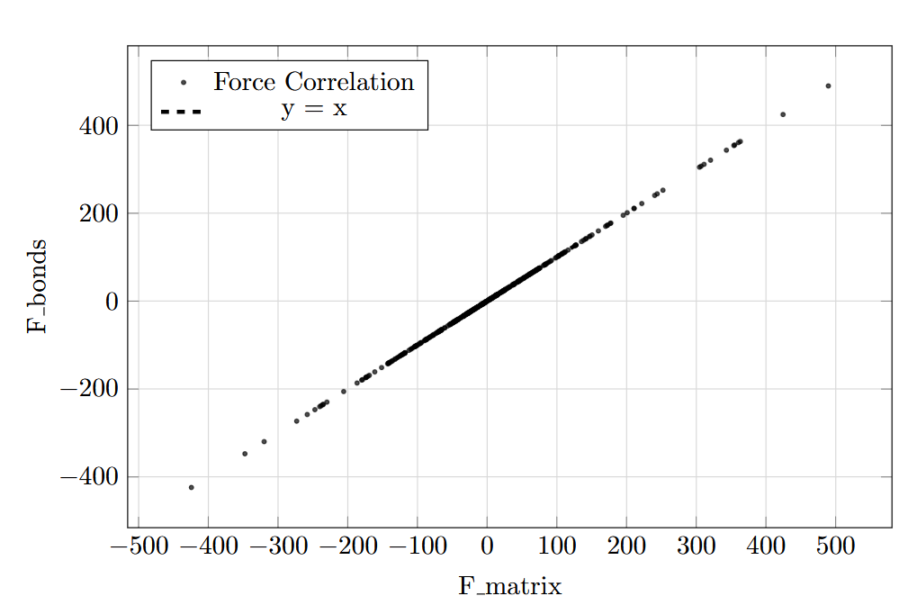
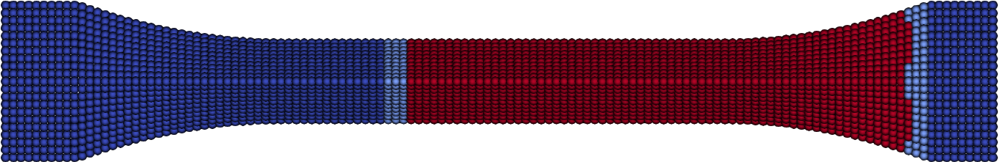

<script type="module">
  import mermaid from 'https://cdn.jsdelivr.net/npm/mermaid@10/dist/mermaid.esm.min.mjs';
  mermaid.initialize({ startOnLoad: true,
  theme: 'white',
  circular: {
    radius: 300,
    direction: 'CW',
  }, });
</script>

<!-- _class: title-slide -->

## Feature overview of simulation framwework PeriLab

<div style="position: absolute; top: 20px; left: 1050px;"> 
    
</div>

Jan-Timo Hesse<a href="https://orcid.org/0000-0002-3006-1520"></a>, Christian Willberg<a href="https://orcid.org/0000-0003-2433-9183"></a>
<br />

> <h style="color: black; ">3th Peridynamic Day - 2025</h> 
> _11th December, 2025 - Magdeburg_

<div style="position: absolute; bottom: 10px; left: 100px; color: grray; font-size: 20px;">
Presentation URL: https://perihub.github.io/Presentations/PDDAY_2025
</div>

---

<!--_class: cols-2-->

# Peridynamic Framework (PeriLab)

<div class=ldiv>

-  A high-performance, open-source peridynamic framework in Julia
- Designed to be extensible and modular, allowing users to easily add new features and solvers
- Built-in support for various material models and boundary conditions
- Support for multiphysics and multi-step simulations.
- Extensive documentation and community support
</div>
<div class=rdiv style="margin-top:80px">


</div>

---

# PeriLab vs. Alternative solutions

<div style="display: flex; justify-content: space-between;">

<div style="flex: 1; margin-right: 0px;">

##

  <div class="mermaid">
  %%{init: { 'theme':'forest','quadrantChart': { 'pointLabelFontSize': '130%'} } }%%
  quadrantChart
    x-axis Low Functionalty --> High Functionalty
    y-axis Hard to use --> Simple to use
    Peridigm: [0.85, 0.2]
    PeriLab: [0.85, 0.8]
    EMU: [0.95, 0.1]
    PeriPy: [0.2, 0.7]
    Peridynamics.jl: [0.7, 0.6]
    PeriPyDIC: [0.2, 0.6]
    LAMMPS: [0.3, 0.3]
    PeriFlakes: [0.35, 0.4]
    Relation-Based Software: [0.4, 0.25]
    BB_PD: [0.2, 0.50]
    PeriDEM: [0.13, 0.3]
    </div>

</div>

<div style="flex: 1; margin-right: -300px;">

## Reference

[PeriLab](https://gitlab.com/dlr-perihub/PeriLab.jl)
[Peridynamics.jl](https://github.com/kaipartmann/Peridynamics.jl)
[Peridigm](https://link.springer.com/article/10.1007/s42102-023-00100-0)
[EMU](https://www.osti.gov/biblio/1351608)
[PeriPy](https://doi.org/10.1016/j.cma.2021.114085)
[PeriPyDIC](https://link.springer.com/article/10.1007/s11043-017-9342-3)
[LAMMPS](https://www.osti.gov/biblio/959309/)
[PeriFlakes](https://doi.org/10.1016/j.cma.2017.04.016)
[Relation-Based Software](https://doi.org/10.1016/j.advengsoft.2022.103124)
[BB_PD](https://doi.org/10.1016/j.compstruc.2021.106682)
[PeriDEM](https://doi.org/10.1016/j.jmps.2021.104376)

</div>

---

# Why PeriLab


---

# PD solving strategies


##  Material point method
$\begin{equation}
\mathbf{F}_{int,i}=\sum_{j \in \mathcal{H}_i}\underline{\mathbf{T}}_{ij}\langle\boldsymbol{\xi}_{ij}\rangle V_j,
\end{equation}$
__Advantages__  
- Fast to implement
- Failure propagation
- Discretization

__Diadvantages__  
- Convergence is lower
- Surfaces are not known


---

# Solver Overview

- **Verlet**
  - Explicit solver for non-linear problems
- **Static**
  - Static solver for linear problems
- **Matrix Verlet**
  - Efficient matrix-based explicit solver for non-linear problems
- **Matrix Linear Static**
  - Efficient matrix-based static solver for linear problems

---

## Matrix based approach

- Use correspondence stiffness matrix based on material point method

__Advantages__ 
- Linear static analysis possible
- Less operations per time step if Verlet is used

__Diadvantages__  
- Matrix update is costly
- Algorithms are more complex



---

## Main Advantage

- Allows reduction methods
- Currently under development
- Static and dynamic reduction
 


$\begin{equation}
\begin{bmatrix}
\boldsymbol{K}_{mm} & \boldsymbol{K}_{ms} \\
\boldsymbol{K}_{sm} & \boldsymbol{K}_{ss}
\end{bmatrix}
\begin{bmatrix}
\boldsymbol{u}_m \\ \boldsymbol{u}_s
\end{bmatrix}=
\begin{bmatrix}
\boldsymbol{F}_m \\ \boldsymbol{F}_s
\end{bmatrix}
\end{equation}$

$\boldsymbol{F}_s = \boldsymbol{0}$
$\begin{equation}
\boldsymbol{K}_{sm} \boldsymbol{u}_m + \boldsymbol{K}_{ss} \boldsymbol{u}_s = \boldsymbol{0}
\end{equation}$

---

$\begin{equation}
\boldsymbol{u}_s = -\boldsymbol{K}_{ss}^{-1} \boldsymbol{K}_{sm} \boldsymbol{u}_m
\end{equation}$

$\begin{equation}
\boldsymbol{K}_{mm} \boldsymbol{u}_m + \boldsymbol{K}_{ms} \left(-\boldsymbol{K}_{ss}^{-1} \boldsymbol{K}_{sm} \boldsymbol{u}_m\right) = \boldsymbol{F}_m
\end{equation}$

$\begin{equation}
\boldsymbol{K}_{\text{red}} = \boldsymbol{K}_{mm} - \boldsymbol{K}_{ms} \boldsymbol{K}_{ss}^{-1} \boldsymbol{K}_{sm}
\end{equation}$

- Currently under testing
- Split $\mathbf{K}_{mm}$ in material point part and matrix part
  - Allows easy implementation of fracture or non-linear material
  - Reduction of degrees of freedoms

 

---
<style scoped>
table {
    width: 100%;
    font-size: 24px;
}
</style>

# Module Overview

|Material|Damage|Thermal|Contact|Coupling|Additive|Degradation|
|---|---|---|---|---|---|---|
|Bond-Based|Critical Stretch|Thermal Flow|Penalty|FEM-PD|Damage-based|*Bond-based Corrosion*
|PD Solid Elastic/Plastic|Critical Energy|Heat Transfer|*Short-Range*|Guyan Reduction||*Thermal Decomposition*
|Correspondence Elastic/Plastic||Thermal Expansion|
|Correspondence UMAT/VUMAT||HETVAL|
|Bond Associated Correspondence|


---

## Temperature

- Convection
- Heat transfer
- Thermo-mechanical coupling


---

## Interblock damage

- Damage between layers or material
- Bonds handled differently if they exist in two blocks


---

# Input and Output Formats

- Input
  - Text file
  - Exodus file
  - Abaqus model
- Output
  - Exodus file
  - CSV file

---

<!-- _class: section-slide-plane -->

## Examples

---
# Examples - RVE

<br/>
<iframe width="1150" height="500" src="https://www.youtube.com/embed/ClV2ojQPrFM?si=eROuZGPdBpXTnmef" title="YouTube video player" frameborder="0" allow="accelerometer; autoplay; clipboard-write; encrypted-media; gyroscope; picture-in-picture; web-share" referrerpolicy="strict-origin-when-cross-origin" allowfullscreen></iframe>

---
# Examples - Impact
<br/>
<iframe width="1150" height="500" src="https://www.youtube.com/embed/qj7xGgmjEdE?si=wTN42HPnBmSPxwJ4" title="YouTube video player" frameborder="0" allow="accelerometer; autoplay; clipboard-write; encrypted-media; gyroscope; picture-in-picture; web-share" referrerpolicy="strict-origin-when-cross-origin" allowfullscreen></iframe>

---
# Examples - Additive
<br/>
<iframe width="1150" height="500" src="https://www.youtube.com/embed/dGfJG9AoL4g?si=-i41xB0_XemF87ts" title="YouTube video player" frameborder="0" allow="accelerometer; autoplay; clipboard-write; encrypted-media; gyroscope; picture-in-picture; web-share" referrerpolicy="strict-origin-when-cross-origin" allowfullscreen></iframe>

---

# Examples - Anisotropic Material


---

# Examples - Anisotropic Damage


---

# Examples - Interlaminar Failure


---

# Examples - FEM-Coupling


---


# Live Demonstration

## Module integration


```
module my_demo_mod
```

```
function damage_name()
    return "module name"
end
```

- define a yaml file
- define variables and call them
- write variable to nodes
- [Examplary models](https://github.com/PeriHub/PeriLab.jl/tree/main/examples/Seminars/) 

---
<!-- _class: section-slide-rocket -->
## Get-Started
 

---

# How to get started with PeriLab?

- Ready to use application:
  - Download and install [PeriHub](https://github.com/PeriHub/PeriHub)
- Just the simulation core:
  - Download the docker image from [Docker Hub](https://hub.docker.com/r/perihub/perilab)
  - Download the julia package with: `Pkg.add("PeriLab")`
  - Download the [release files](https://github.com/PeriHub/PeriLab.jl/releases)
- Develop and contribute:
  - Clone the [repository](https://github.com/PeriHub/PeriLab.jl) and follow the development guide
    1. Implement your own peridynamic models (don't worry it's easy!)
    2. Create a pull request in order to contribute 


---

# Planned Features

- Dynamic solver switch
- Corrosive material models
- Performance and usability improvements
- More material and damage models 

---

# Feedback Time

- Scan the QR-code
- What is missing for you to use PeriLab?
- Further questions?


---

# Feedback Time

<iframe src="https://app.sli.do/event/5mmfvHmXVAHMyJPJJY11dA" width="90%" height="85%" style="border: 0; margin-left: 70px"></iframe>

---

<!-- _class: title-slide -->

## Introduction to Peridynamic Web-Framework PeriHub 

<div style="position: absolute; top: 20px; left: 1050px;"> 
    
</div>

Jan-Timo Hesse<a href="https://orcid.org/0000-0002-3006-1520"></a>, Christian Willberg<a href="https://orcid.org/0000-0003-2433-9183"></a>
<br />

> <h style="color: black; ">3th Peridynamic Day - 2025</h> 
> _11th December, 2025 - Magdeburg_

<div style="position: absolute; bottom: 10px; left: 100px; color: grray; font-size: 20px;">
Presentation URL: https://perihub.github.io/Presentations/PDDAY_2025
</div>

---

# PeriHub


- **Peridynamic simulation engine** – extends PeriLab for detailed material‑science studies.  
- **Easy to use & portable** – GUI, REST API, and Docker for quick setup on any platform.  
- **Trusted, FAIR‑compliant** – built by experts (incl. DLR) with rigorous quality and open‑science standards.


---

# Features - What can I do with PeriHub?


- **Model Creation** - Create models using predefined templates or import your own.
- **Simulation Execution** - Run simulations using our powerful engine.
- **Data Visualization** - Visualize results using our built-in tools or export data for further analysis.
- **Analysis** - Analyze results and generate reports using your own python methods.

---

<!-- _class: section-slide-vulcan -->

## Overview

---


---

<!-- _class: section-slide-rocket -->

## Live Demo

---

# How to get started with PeriHub?

- Ready to use application:
  - Follow the guide [here](https://github.com/PeriHub/PeriHub?tab=readme-ov-file#getting-started-with-perihub-services) to get started with PeriHub services.
- Develop and contribute:
  - Go to the [Cintribution guide](https://github.com/PeriHub/PeriHub?tab=readme-ov-file#contributing)
  - Submit your changes as a Pull Request

---

## Planned Features

- Live Demo will be released
- Stability and user experience improvements
- Improve Documentation

---

# Thank you!

[Jan-Timo Hesse](mailto:jan-timo.hesse@dlr.de) (DLR)
[Christian Willberg](mailto:christian.willberg@h2.de) (h2)

